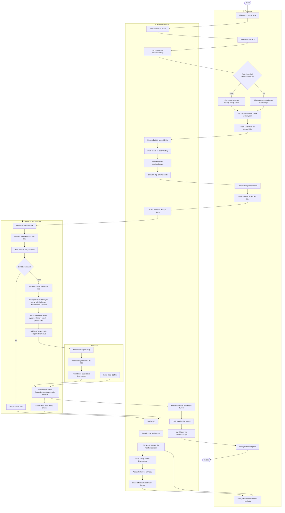
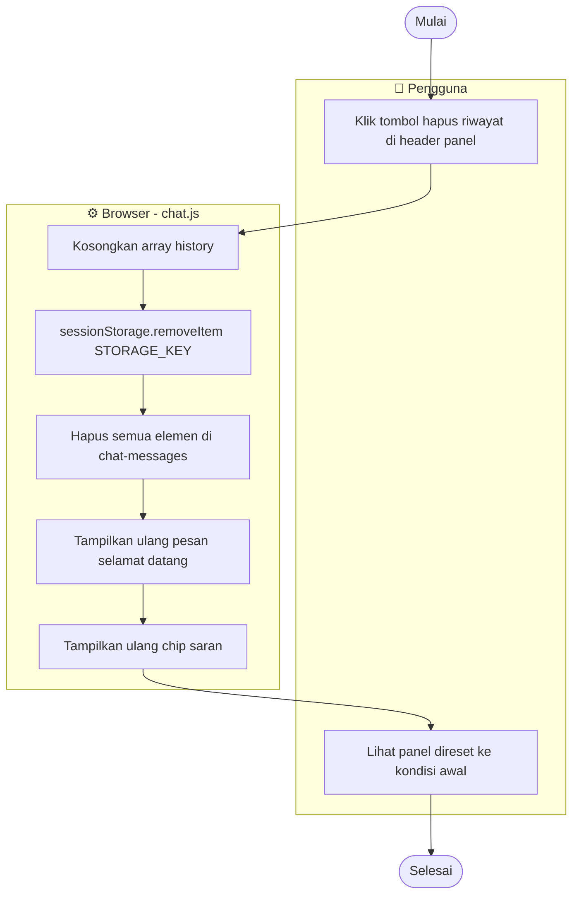
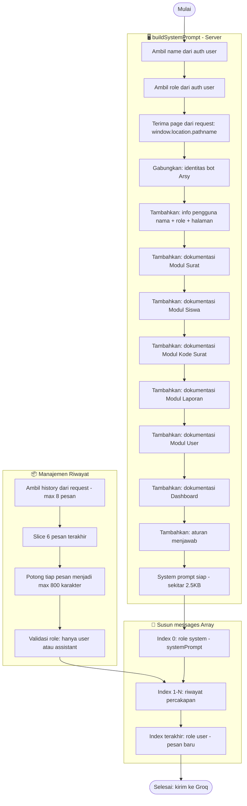

# Activity Diagram — Arsy AI Chat

---

## Buka Widget dan Kirim Pesan

```mermaid
flowchart TD
    START([Mulai]) --> A1

    subgraph USER["👤 Pengguna"]
        A1[Klik tombol toggle Arsy]
        A2[Panel chat terbuka]
        A3{Ada riwayat di sessionStorage?}
        A4[Lihat pesan selamat datang + chip saran]
        A5[Lihat riwayat percakapan sebelumnya]
        A6[Klik chip saran ATAU ketik pertanyaan]
        A7[Tekan Enter atau klik tombol kirim]
        A8[Lihat bubble pesan sendiri]
        A9[Lihat animasi typing tiga titik]
        A10[Lihat jawaban muncul kata per kata]
        A11[Lihat jawaban lengkap]
    end

    subgraph CLIENT["⚙️ Browser - chat.js"]
        C1[Animasi slide-in panel]
        C2[loadHistory dari sessionStorage]
        C3[Render bubble user di DOM]
        C4[Push pesan ke array history]
        C5[saveHistory ke sessionStorage]
        C6[showTyping - animasi dots]
        C7[POST /chat/ask dengan fetch]
        C8[hideTyping]
        C9[Buat bubble bot kosong]
        C10[Baca SSE stream via ReadableStream]
        C11[Parse setiap chunk: delta.content]
        C12[Append token ke fullReply]
        C13[Render formatMarkdown + kursor]
        C14[Render jawaban final tanpa kursor]
        C15[Push jawaban ke history]
        C16[saveHistory ke sessionStorage]
    end

    subgraph SERVER["🖥️ Laravel - ChatController"]
        S1[Terima POST /chat/ask]
        S2[Validasi: message max 500 char]
        S3[Rate limit: 30 req per menit]
        S4{Limit terlampaui?}
        S5[Return HTTP 429]
        S6[auth user: ambil name dan role]
        S7[buildSystemPrompt: inject nama, role, halaman, dokumentasi 5 modul]
        S8[Susun messages array: system + history max 6 + pesan baru]
        S9[curl POST ke Groq API dengan stream true]
        S10[WRITEFUNCTION: forward chunk langsung ke browser]
        S11[ob flush dan flush setiap chunk]
    end

    subgraph GROQ["🤖 Groq API"]
        G1[Terima messages array]
        G2[Proses dengan LLaMA 3.3 70B]
        G3[Kirim token SSE: data: delta.content]
        G4[Kirim data: DONE]
    end

    A1 --> C1 --> A2 --> C2 --> A3
    A3 -->|Tidak| A4 --> A6
    A3 -->|Ya| A5 --> A6
    A6 --> A7 --> C3 --> C4 --> C5 --> C6
    C6 --> A8 --> A9 --> C7

    C7 --> S1 --> S2 --> S3 --> S4
    S4 -->|Ya| S5 --> C8
    S4 -->|Tidak| S6 --> S7 --> S8 --> S9

    S9 --> G1 --> G2 --> G3
    G3 --> S10 --> S11 --> C8

    C8 --> C9 --> C10 --> C11 --> C12 --> C13 --> A10
    A10 --> C10

    G4 --> S10 --> C14 --> C15 --> C16
    C16 --> A11 --> STOP([Selesai])
```

---

## Hapus Riwayat Chat

```mermaid
flowchart TD
    START([Mulai]) --> A1

    subgraph USER["👤 Pengguna"]
        A1[Klik tombol hapus riwayat di header panel]
        A2[Lihat panel direset ke kondisi awal]
    end

    subgraph CLIENT["⚙️ Browser - chat.js"]
        C1[Kosongkan array history]
        C2[sessionStorage.removeItem STORAGE_KEY]
        C3[Hapus semua elemen di chat-messages]
        C4[Tampilkan ulang pesan selamat datang]
        C5[Tampilkan ulang chip saran]
    end

    A1 --> C1 --> C2 --> C3 --> C4 --> C5 --> A2 --> STOP([Selesai])
```

---

## Bagaimana AI Mendapatkan Konteks

```mermaid
flowchart TD
    START([Mulai]) --> B1

    subgraph BUILD["🖥️ buildSystemPrompt - Server"]
        B1[Ambil name dari auth user]
        B2[Ambil role dari auth user]
        B3[Terima page dari request: window.location.pathname]
        B4[Gabungkan: identitas bot Arsy]
        B5[Tambahkan: info pengguna nama + role + halaman]
        B6[Tambahkan: dokumentasi Modul Surat]
        B7[Tambahkan: dokumentasi Modul Siswa]
        B8[Tambahkan: dokumentasi Modul Kode Surat]
        B9[Tambahkan: dokumentasi Modul Laporan]
        B10[Tambahkan: dokumentasi Modul User]
        B11[Tambahkan: dokumentasi Dashboard]
        B12[Tambahkan: aturan menjawab]
        B13[System prompt siap - sekitar 2.5KB]
    end

    subgraph HIST["📦 Manajemen Riwayat"]
        H1[Ambil history dari request - max 8 pesan]
        H2[Slice 6 pesan terakhir]
        H3[Potong tiap pesan menjadi max 800 karakter]
        H4[Validasi role: hanya user atau assistant]
    end

    subgraph COMPOSE["📨 Susun messages Array"]
        M1[Index 0: role system - systemPrompt]
        M2[Index 1-N: riwayat percakapan]
        M3[Index terakhir: role user - pesan baru]
    end

    B1 --> B2 --> B3 --> B4 --> B5 --> B6 --> B7 --> B8 --> B9 --> B10 --> B11 --> B12 --> B13
    H1 --> H2 --> H3 --> H4
    B13 --> M1
    H4 --> M2
    M1 --> M2 --> M3 --> STOP([Selesai: kirim ke Groq])
```
