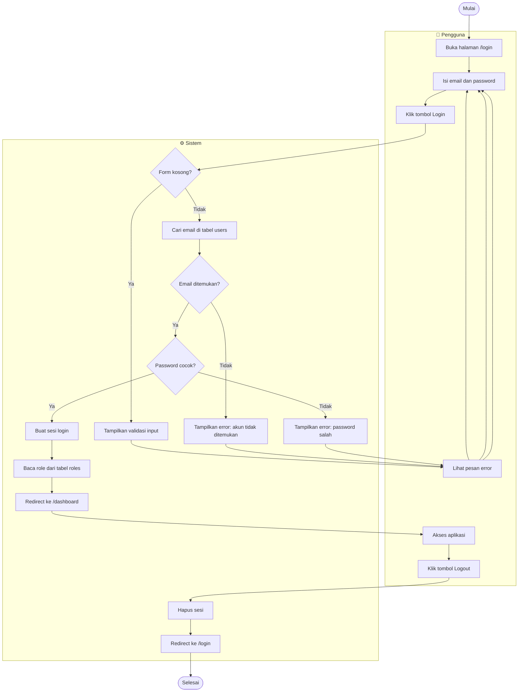

# Activity Diagram — Autentikasi

---

## Login

---

## Ringkasan Alur

| Langkah | Pelaku | Keterangan |
|---|---|---|
| Buka /login | Pengguna | Redirect otomatis dari `/` |
| Isi form | Pengguna | Email + password |
| Validasi kosong | Sistem | Client-side + server-side |
| Cari akun | Sistem | Query tabel `users` by email |
| Verifikasi password | Sistem | `bcrypt` check via `Hash::check()` |
| Buat sesi | Sistem | Laravel session driver |
| Baca role | Sistem | Eager load `roles` untuk akses kontrol |
| Redirect dashboard | Sistem | `/dashboard` |
| Logout | Pengguna | `POST /logout` |
| Hapus sesi | Sistem | `Auth::logout()` + invalidate token |
