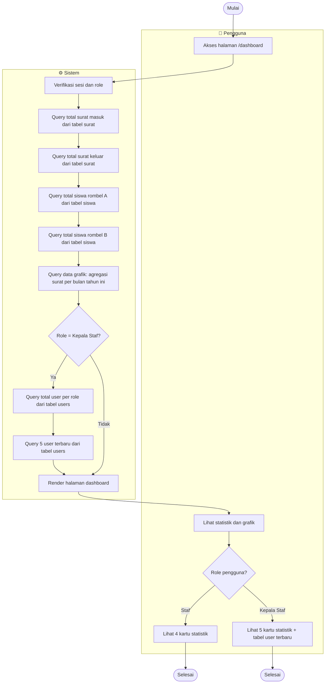

# Activity Diagram — Dashboard

---

## Load Dashboard

---

## Ringkasan Konten per Role

| Elemen | Staf | Kepala Staf |
|---|:---:|:---:|
| Kartu Total Surat Masuk | ✅ | ✅ |
| Kartu Total Surat Keluar | ✅ | ✅ |
| Kartu Total Siswa Rombel A | ✅ | ✅ |
| Kartu Total Siswa Rombel B | ✅ | ✅ |
| Kartu Total User | ❌ | ✅ |
| Grafik Tren Surat Bulanan | ✅ | ✅ |
| Tabel 5 User Terbaru | ❌ | ✅ |
