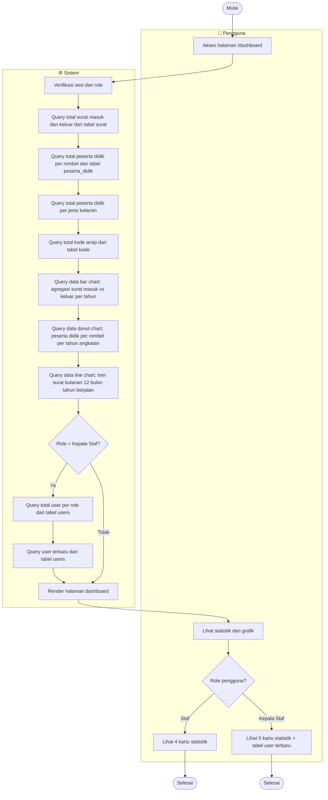

# Activity Diagram — Dashboard

---

## Load Dashboard

---

## Ringkasan Konten per Role

| Elemen | Staf | Kepala Staf |
|---|:---:|:---:|
| Kartu Surat (total + badge masuk/keluar) | ✅ | ✅ |
| Kartu Peserta Didik (total + badge rombel + badge L/P) | ✅ | ✅ |
| Kartu Kode Arsip | ✅ | ✅ |
| Kartu Rekap (shortcut laporan) | ✅ | ✅ |
| Kartu Users (total + breakdown role) | ❌ | ✅ |
| Bar Chart Statistik Surat (filter tahun) | ✅ | ✅ |
| Donut Chart Peserta Didik per Rombel (filter tahun) | ✅ | ✅ |
| Line Chart Tren Surat Bulanan | ✅ | ✅ |
| Tabel User Terbaru | ❌ | ✅ |

---

## Variabel Controller Dashboard

| Variabel | Deskripsi | Role |
|---|---|---|
| `$totalSurat` | Total semua surat | Semua |
| `$totalSuratMasuk` | Total surat masuk (tahun berjalan) | Semua |
| `$totalSuratKeluar` | Total surat keluar (tahun berjalan) | Semua |
| `$totalSuratMasukAll` | Total surat masuk keseluruhan | Semua |
| `$totalSuratKeluarAll` | Total surat keluar keseluruhan | Semua |
| `$totalPesertaDidikAll` | Total seluruh peserta didik | Semua |
| `$peserta_didikPerRombelAll` | Jumlah peserta didik per rombel | Semua |
| `$peserta_didikLakiAll` | Jumlah peserta didik laki-laki | Semua |
| `$peserta_didikPerempuanAll` | Jumlah peserta didik perempuan | Semua |
| `$peserta_didikPerTahun` | Data peserta didik per tahun angkatan (filter donut) | Semua |
| `$totalKode` | Total kode arsip | Semua |
| `$trenSuratMasuk` | Array tren bulanan surat masuk | Semua |
| `$trenSuratKeluar` | Array tren bulanan surat keluar | Semua |
| `$trenSuratPerTahun` | Data tren surat per tahun (filter bar chart) | Semua |
| `$totalUser` | Total semua user | Kepala Staf |
| `$totalKepala` | Jumlah user role Kepala Staf | Kepala Staf |
| `$totalStaf` | Jumlah user role Staf | Kepala Staf |
| `$recentUsers` | Daftar user terbaru (untuk tabel) | Kepala Staf |

---

## Chart Dashboard (3 Chart)

| Chart | Tipe | Deskripsi | Filter |
|---|---|---|---|
| **Statistik Surat** | Bar Chart | Perbandingan surat masuk vs keluar | Input tahun |
| **Statistik Peserta Didik** | Donut Chart | Distribusi per rombel, badge gender L/P | Input tahun angkatan |
| **Tren Surat Bulanan** | Line Chart | Tren 12 bulan tahun berjalan, dua garis (masuk & keluar) | — |

> **Dark mode:** Observer `MutationObserver` memantau atribut `data-theme` pada tag `<html>`. Saat tema berubah, warna axis, legend, dan tooltip semua chart diperbarui secara otomatis.
