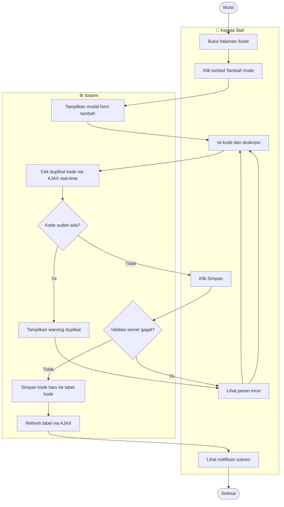
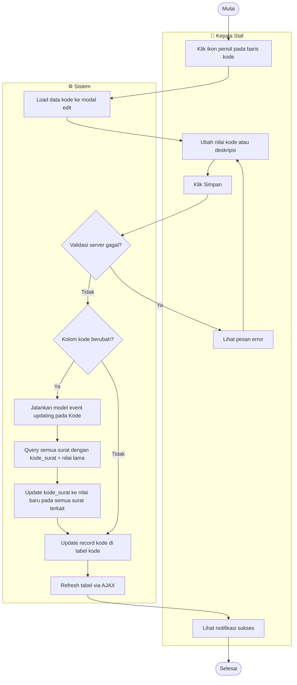
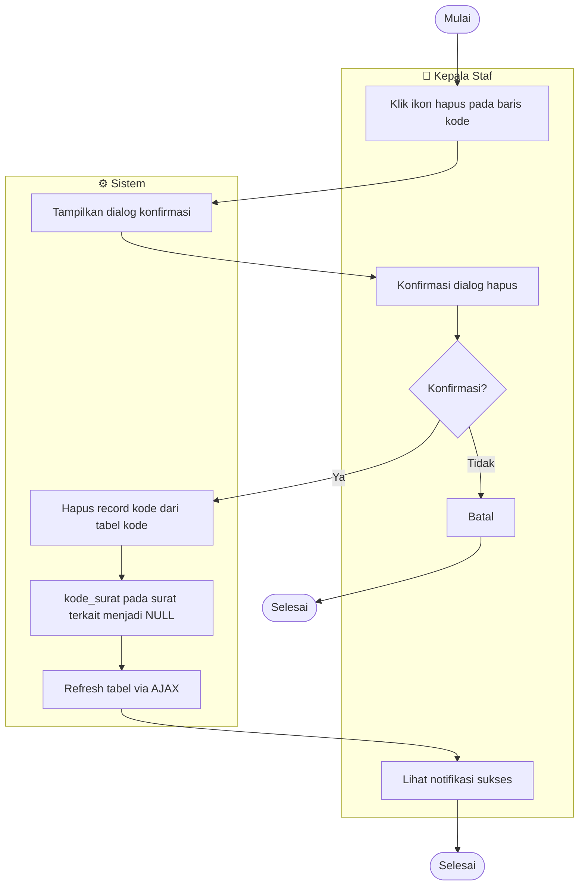

# Activity Diagram — Modul Kode Surat

---

## Tambah Kode Surat

```mermaid
flowchart TD
    START([Mulai]) --> A1

    subgraph USER["👤 Kepala Staf"]
        A1[Buka halaman /kode]
        A2[Klik tombol Tambah Kode]
        A3[Isi kode dan deskripsi]
        A4[Klik Simpan]
        A5[Lihat notifikasi sukses]
        A6[Lihat pesan error]
    end

    subgraph SYSTEM["⚙️ Sistem"]
        B1[Tampilkan modal form tambah]
        B2[Cek duplikat kode via AJAX real-time]
        B3{Kode sudah ada?}
        B4[Tampilkan warning duplikat]
        B5{Validasi server gagal?}
        B6[Simpan kode baru ke tabel kode]
        B7[Refresh tabel via AJAX]
    end

    A1 --> A2 --> B1 --> A3
    A3 --> B2 --> B3
    B3 -->|Ya| B4 --> A6 --> A3
    B3 -->|Tidak| A4 --> B5
    B5 -->|Ya| A6 --> A3
    B5 -->|Tidak| B6 --> B7 --> A5 --> STOP([Selesai])
```

---

## Edit Kode Surat (dengan Cascade Update)

```mermaid
flowchart TD
    START([Mulai]) --> A1

    subgraph USER["👤 Kepala Staf"]
        A1[Klik ikon pensil pada baris kode]
        A2[Ubah nilai kode atau deskripsi]
        A3[Klik Simpan]
        A4[Lihat notifikasi sukses]
        A5[Lihat pesan error]
    end

    subgraph SYSTEM["⚙️ Sistem"]
        B1[Load data kode ke modal edit]
        B2{Validasi server gagal?}
        B3{Kolom kode berubah?}
        B4[Jalankan model event updating pada Kode]
        B5[Query semua surat dengan kode_surat = nilai lama]
        B6[Update kode_surat ke nilai baru pada semua surat terkait]
        B7[Update record kode di tabel kode]
        B8[Refresh tabel via AJAX]
    end

    A1 --> B1 --> A2 --> A3 --> B2
    B2 -->|Ya| A5 --> A2
    B2 -->|Tidak| B3
    B3 -->|Ya| B4 --> B5 --> B6 --> B7
    B3 -->|Tidak| B7
    B7 --> B8 --> A4 --> STOP([Selesai])
```

---

## Hapus Kode Surat

```mermaid
flowchart TD
    START([Mulai]) --> A1

    subgraph USER["👤 Kepala Staf"]
        A1[Klik ikon hapus pada baris kode]
        A2[Konfirmasi dialog hapus]
        A3{Konfirmasi?}
        A4[Batal]
        A5[Lihat notifikasi sukses]
    end

    subgraph SYSTEM["⚙️ Sistem"]
        B1[Tampilkan dialog konfirmasi]
        B2[Hapus record kode dari tabel kode]
        B3[kode_surat pada surat terkait menjadi NULL]
        B4[Refresh tabel via AJAX]
    end

    A1 --> B1 --> A2 --> A3
    A3 -->|Tidak| A4 --> STOP1([Selesai])
    A3 -->|Ya| B2 --> B3 --> B4 --> A5 --> STOP2([Selesai])
```
