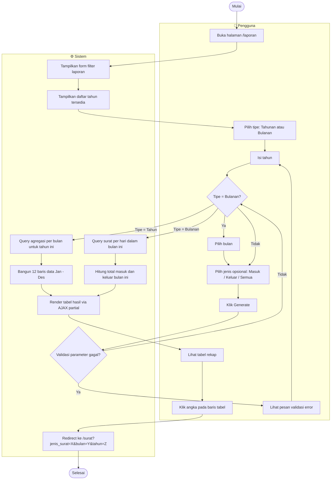
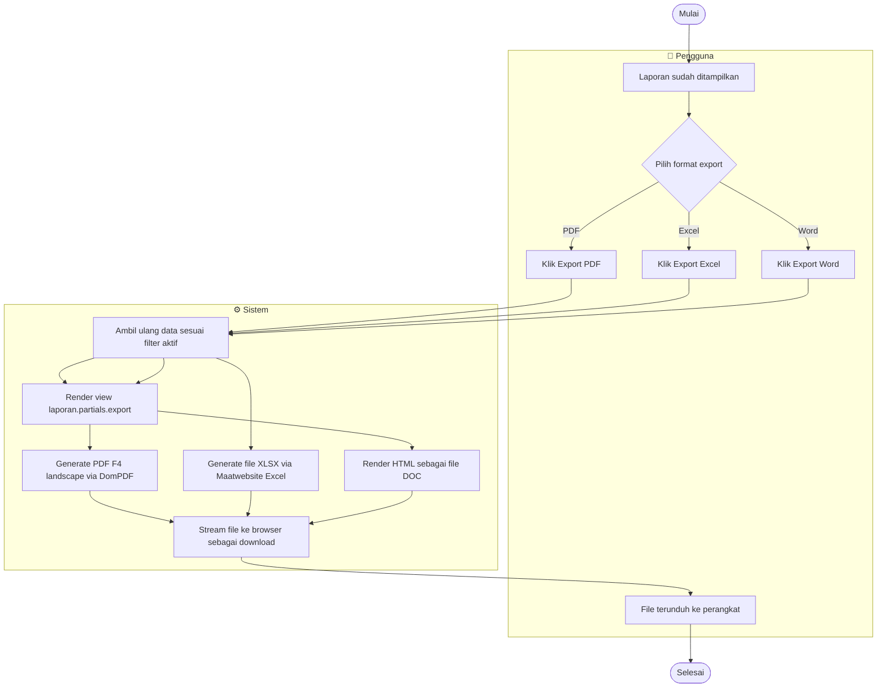

# Activity Diagram — Modul Laporan

---

## Generate Laporan

```mermaid
flowchart TD
    START([Mulai]) --> A1

    subgraph USER["👤 Pengguna"]
        A1[Buka halaman /laporan]
        A2[Pilih tipe: Tahunan atau Bulanan]
        A3[Isi tahun]
        A4{Tipe = Bulanan?}
        A5[Pilih bulan]
        A6[Pilih jenis opsional: Masuk / Keluar / Semua]
        A7[Klik Generate]
        A8[Lihat tabel rekap]
        A9[Klik angka pada baris tabel]
        A10[Lihat pesan validasi error]
    end

    subgraph SYSTEM["⚙️ Sistem"]
        B1[Tampilkan form filter laporan]
        B2[Tampilkan daftar tahun tersedia]
        B3{Validasi parameter gagal?}
        B4[Query agregasi per bulan untuk tahun ini]
        B5[Bangun 12 baris data Jan - Des]
        B6[Query surat per hari dalam bulan ini]
        B7[Hitung total masuk dan keluar bulan ini]
        B8[Render tabel hasil via AJAX partial]
        B9[Redirect ke /surat?jenis_surat=X&bulan=Y&tahun=Z]
    end

    A1 --> B1 --> B2
    B2 --> A2 --> A3 --> A4
    A4 -->|Ya| A5 --> A6
    A4 -->|Tidak| A6
    A6 --> A7 --> B3
    B3 -->|Ya| A10 --> A3
    B3 -->|Tidak| A4
    A4 -->|Tipe = Tahun| B4 --> B5 --> B8
    A4 -->|Tipe = Bulanan| B6 --> B7 --> B8
    B8 --> A8 --> A9 --> B9 --> STOP([Selesai])
```

---

## Export Laporan

```mermaid
flowchart TD
    START([Mulai]) --> A1

    subgraph USER["👤 Pengguna"]
        A1[Laporan sudah ditampilkan]
        A2{Pilih format export}
        A3[Klik Export PDF]
        A4[Klik Export Excel]
        A5[Klik Export Word]
        A6[File terunduh ke perangkat]
    end

    subgraph SYSTEM["⚙️ Sistem"]
        B1[Ambil ulang data sesuai filter aktif]
        B2[Render view laporan.partials.export]
        B3[Generate PDF F4 landscape via DomPDF]
        B4[Generate file XLSX via Maatwebsite Excel]
        B5[Render HTML sebagai file DOC]
        B6[Stream file ke browser sebagai download]
    end

    A1 --> A2
    A2 -->|PDF| A3 --> B1 --> B2 --> B3 --> B6
    A2 -->|Excel| A4 --> B1 --> B4 --> B6
    A2 -->|Word| A5 --> B1 --> B2 --> B5 --> B6
    B6 --> A6 --> STOP([Selesai])
```
