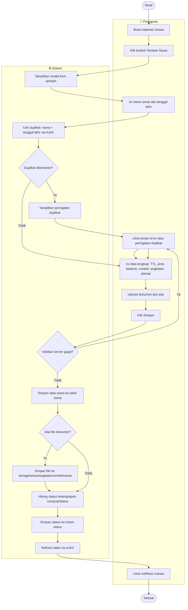
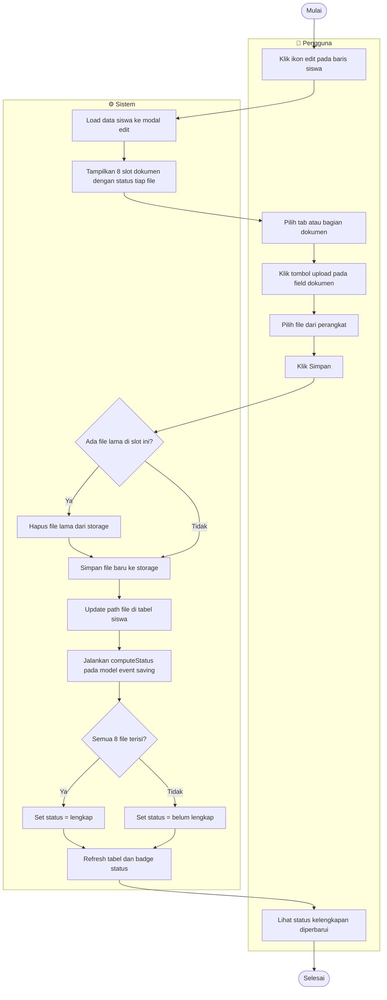
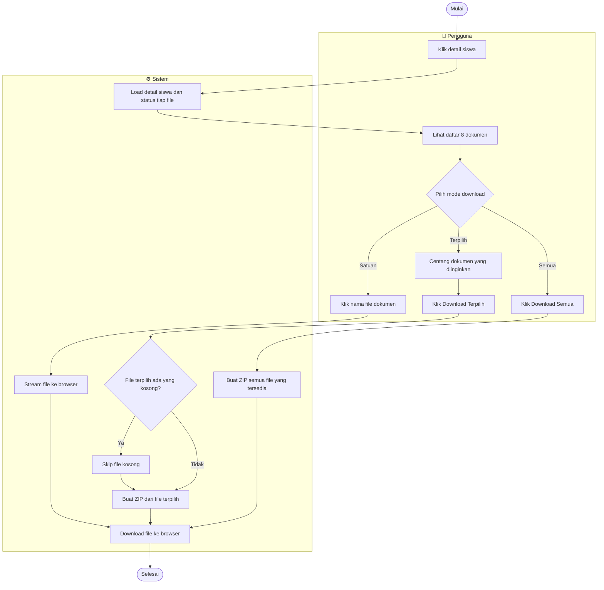

# Activity Diagram — Modul Siswa

---

## Tambah Data Siswa

```mermaid
flowchart TD
    START([Mulai]) --> A1

    subgraph USER["👤 Pengguna"]
        A1[Buka halaman /siswa]
        A2[Klik tombol Tambah Siswa]
        A3[Isi nama siswa dan tanggal lahir]
        A4[Isi data lengkap: TTL, jenis kelamin, rombel, angkatan, alamat]
        A5[Upload dokumen jika ada]
        A6[Klik Simpan]
        A7[Lihat notifikasi sukses]
        A8[Lihat pesan error atau peringatan duplikat]
    end

    subgraph SYSTEM["⚙️ Sistem"]
        B1[Tampilkan modal form tambah]
        B2[Cek duplikat: nama + tanggal lahir via AJAX]
        B3{Duplikat ditemukan?}
        B4[Tampilkan peringatan duplikat]
        B5{Validasi server gagal?}
        B6[Simpan data siswa ke tabel siswa]
        B7{Ada file dokumen?}
        B8[Simpan file ke storage/siswa/angkatan/rombel/nama]
        B9[Hitung status kelengkapan computeStatus]
        B10[Simpan status ke kolom status]
        B11[Refresh tabel via AJAX]
    end

    A1 --> A2 --> B1 --> A3
    A3 --> B2 --> B3
    B3 -->|Ya| B4 --> A8
    A8 --> A4
    B3 -->|Tidak| A4
    A4 --> A5 --> A6 --> B5
    B5 -->|Ya| A8 --> A4
    B5 -->|Tidak| B6 --> B7
    B7 -->|Ya| B8 --> B9
    B7 -->|Tidak| B9
    B9 --> B10 --> B11 --> A7 --> STOP([Selesai])
```

---

## Upload / Perbarui Dokumen Siswa

```mermaid
flowchart TD
    START([Mulai]) --> A1

    subgraph USER["👤 Pengguna"]
        A1[Klik ikon edit pada baris siswa]
        A2[Pilih tab atau bagian dokumen]
        A3[Klik tombol upload pada field dokumen]
        A4[Pilih file dari perangkat]
        A5[Klik Simpan]
        A6[Lihat status kelengkapan diperbarui]
    end

    subgraph SYSTEM["⚙️ Sistem"]
        B1[Load data siswa ke modal edit]
        B2[Tampilkan 8 slot dokumen dengan status tiap file]
        B3{Ada file lama di slot ini?}
        B4[Hapus file lama dari storage]
        B5[Simpan file baru ke storage]
        B6[Update path file di tabel siswa]
        B7[Jalankan computeStatus pada model event saving]
        B8{Semua 8 file terisi?}
        B9[Set status = lengkap]
        B10[Set status = belum lengkap]
        B11[Refresh tabel dan badge status]
    end

    A1 --> B1 --> B2 --> A2 --> A3 --> A4 --> A5
    A5 --> B3
    B3 -->|Ya| B4 --> B5
    B3 -->|Tidak| B5
    B5 --> B6 --> B7 --> B8
    B8 -->|Ya| B9 --> B11
    B8 -->|Tidak| B10 --> B11
    B11 --> A6 --> STOP([Selesai])
```

---

## Download Dokumen Siswa

```mermaid
flowchart TD
    START([Mulai]) --> A1

    subgraph USER["👤 Pengguna"]
        A1[Klik detail siswa]
        A2[Lihat daftar 8 dokumen]
        A3{Pilih mode download}
        A4[Klik nama file dokumen]
        A5[Centang dokumen yang diinginkan]
        A6[Klik Download Terpilih]
        A7[Klik Download Semua]
    end

    subgraph SYSTEM["⚙️ Sistem"]
        B1[Load detail siswa dan status tiap file]
        B2[Stream file ke browser]
        B3{File terpilih ada yang kosong?}
        B4[Skip file kosong]
        B5[Buat ZIP dari file terpilih]
        B6[Buat ZIP semua file yang tersedia]
        B7[Download file ke browser]
    end

    A1 --> B1 --> A2 --> A3
    A3 -->|Satuan| A4 --> B2 --> B7
    A3 -->|Terpilih| A5 --> A6 --> B3
    B3 -->|Ya| B4 --> B5
    B3 -->|Tidak| B5
    B5 --> B7
    A3 -->|Semua| A7 --> B6 --> B7
    B7 --> STOP([Selesai])
```
