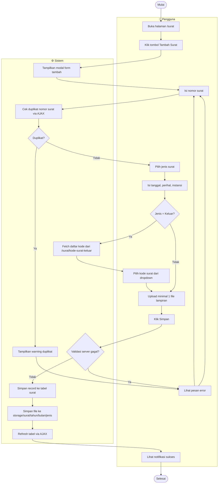
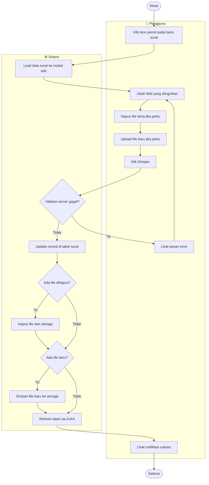
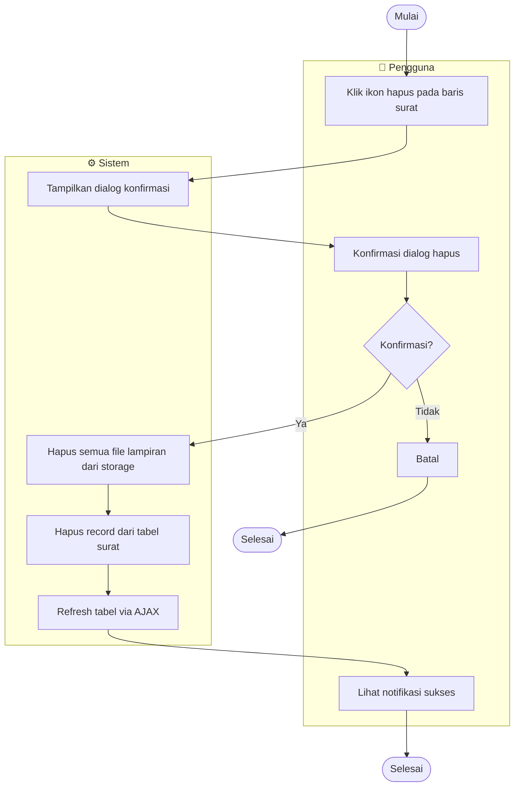
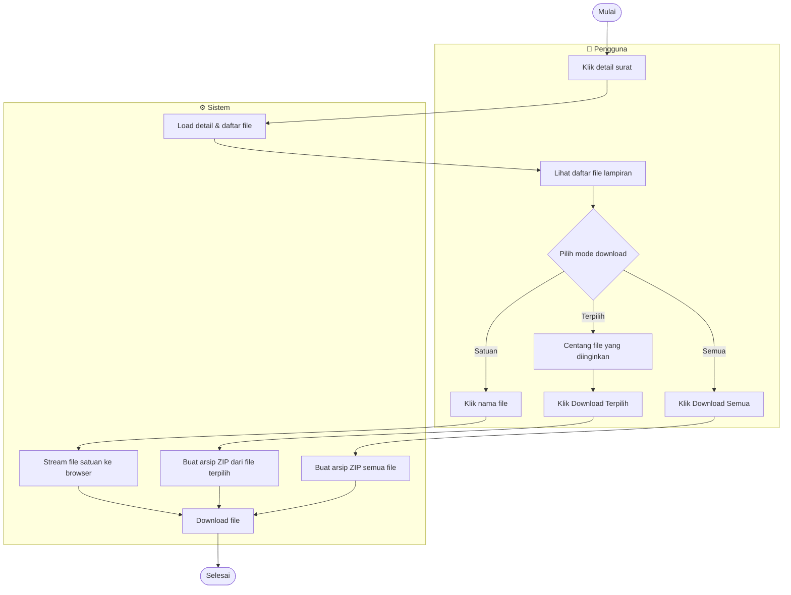

# Activity Diagram — Modul Surat

---

## Tambah Surat

```mermaid
flowchart TD
    START([Mulai]) --> A1

    subgraph USER["👤 Pengguna"]
        A1[Buka halaman /surat]
        A2[Klik tombol Tambah Surat]
        A3[Isi nomor surat]
        A4[Pilih jenis surat]
        A5[Isi tanggal, perihal, instansi]
        A6{Jenis = Keluar?}
        A7[Pilih kode surat dari dropdown]
        A8[Upload minimal 1 file lampiran]
        A9[Klik Simpan]
        A10[Lihat notifikasi sukses]
        A11[Lihat pesan error]
    end

    subgraph SYSTEM["⚙️ Sistem"]
        B1[Tampilkan modal form tambah]
        B2[Cek duplikat nomor surat via AJAX]
        B3{Duplikat?}
        B4[Tampilkan warning duplikat]
        B5[Fetch daftar kode dari /surat/kode-surat-keluar]
        B6{Validasi server gagal?}
        B7[Simpan record ke tabel surat]
        B8[Simpan file ke storage/surat/tahun/bulan/jenis]
        B9[Refresh tabel via AJAX]
    end

    A1 --> A2 --> B1 --> A3
    A3 --> B2 --> B3
    B3 -->|Ya| B4 --> A11 --> A3
    B3 -->|Tidak| A4 --> A5 --> A6
    A6 -->|Ya| B5 --> A7 --> A8
    A6 -->|Tidak| A8
    A8 --> A9 --> B6
    B6 -->|Ya| A11 --> A3
    B6 -->|Tidak| B7 --> B8 --> B9 --> A10 --> STOP([Selesai])
```

---

## Edit Surat

```mermaid
flowchart TD
    START([Mulai]) --> A1

    subgraph USER["👤 Pengguna"]
        A1[Klik ikon pensil pada baris surat]
        A2[Ubah field yang diinginkan]
        A3[Hapus file lama jika perlu]
        A4[Upload file baru jika perlu]
        A5[Klik Simpan]
        A6[Lihat notifikasi sukses]
        A7[Lihat pesan error]
    end

    subgraph SYSTEM["⚙️ Sistem"]
        B1[Load data surat ke modal edit]
        B2{Validasi server gagal?}
        B3[Update record di tabel surat]
        B4{Ada file dihapus?}
        B5[Hapus file dari storage]
        B6{Ada file baru?}
        B7[Simpan file baru ke storage]
        B8[Refresh tabel via AJAX]
    end

    A1 --> B1 --> A2 --> A3 --> A4 --> A5 --> B2
    B2 -->|Ya| A7 --> A2
    B2 -->|Tidak| B3 --> B4
    B4 -->|Ya| B5 --> B6
    B4 -->|Tidak| B6
    B6 -->|Ya| B7 --> B8
    B6 -->|Tidak| B8
    B8 --> A6 --> STOP([Selesai])
```

---

## Hapus Surat

```mermaid
flowchart TD
    START([Mulai]) --> A1

    subgraph USER["👤 Pengguna"]
        A1[Klik ikon hapus pada baris surat]
        A2[Konfirmasi dialog hapus]
        A3{Konfirmasi?}
        A4[Batal]
        A5[Lihat notifikasi sukses]
    end

    subgraph SYSTEM["⚙️ Sistem"]
        B1[Tampilkan dialog konfirmasi]
        B2[Hapus semua file lampiran dari storage]
        B3[Hapus record dari tabel surat]
        B4[Refresh tabel via AJAX]
    end

    A1 --> B1 --> A2 --> A3
    A3 -->|Tidak| A4 --> STOP1([Selesai])
    A3 -->|Ya| B2 --> B3 --> B4 --> A5 --> STOP2([Selesai])
```

---

## Download File Lampiran

```mermaid
flowchart TD
    START([Mulai]) --> A1

    subgraph USER["👤 Pengguna"]
        A1[Klik detail surat]
        A2[Lihat daftar file lampiran]
        A3{Pilih mode download}
        A4[Klik nama file]
        A5[Centang file yang diinginkan]
        A6[Klik Download Terpilih]
        A7[Klik Download Semua]
    end

    subgraph SYSTEM["⚙️ Sistem"]
        B1[Load detail & daftar file]
        B2[Stream file satuan ke browser]
        B3[Buat arsip ZIP dari file terpilih]
        B4[Buat arsip ZIP semua file]
        B5[Download file]
    end

    A1 --> B1 --> A2 --> A3
    A3 -->|Satuan| A4 --> B2 --> B5
    A3 -->|Terpilih| A5 --> A6 --> B3 --> B5
    A3 -->|Semua| A7 --> B4 --> B5
    B5 --> STOP([Selesai])
```
