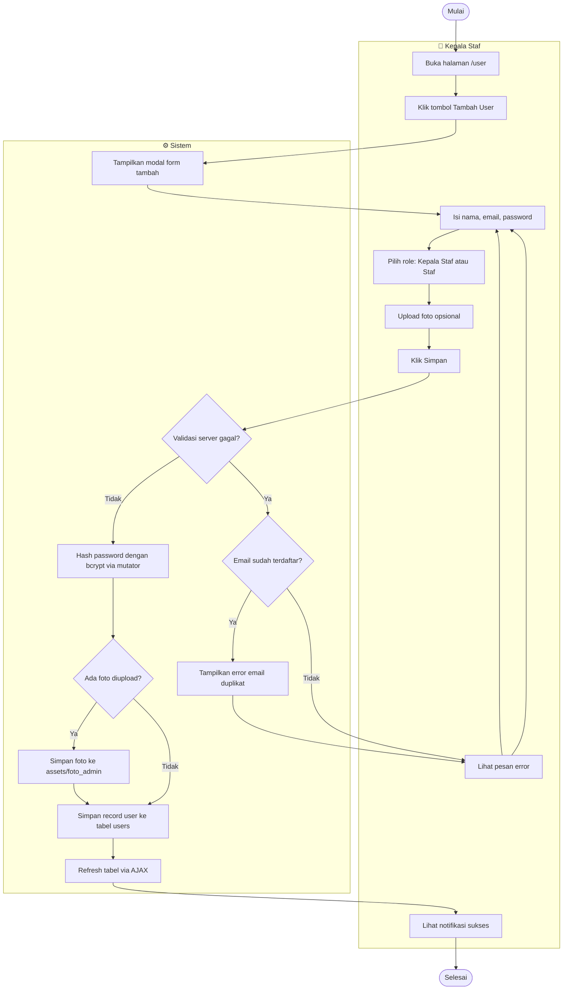
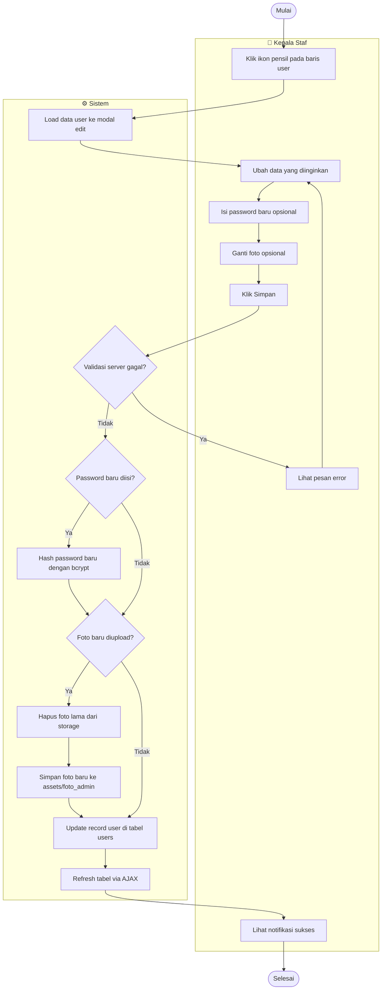
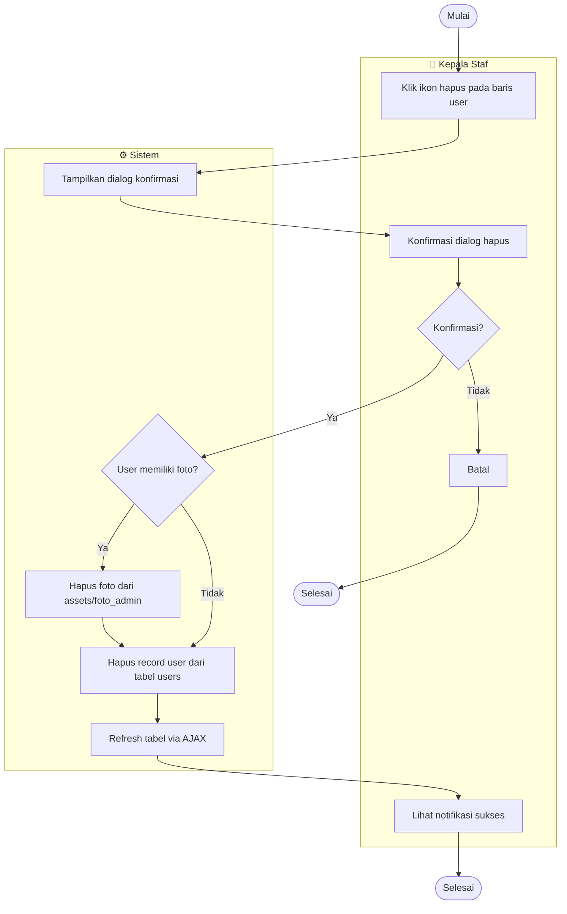

# Activity Diagram — Modul User

> Seluruh aktivitas modul ini hanya dapat dilakukan oleh **Kepala Staf**.

---

## Tambah User

```mermaid
flowchart TD
    START([Mulai]) --> A1

    subgraph USER["👤 Kepala Staf"]
        A1[Buka halaman /user]
        A2[Klik tombol Tambah User]
        A3[Isi nama, email, password]
        A4[Pilih role: Kepala Staf atau Staf]
        A5[Upload foto opsional]
        A6[Klik Simpan]
        A7[Lihat notifikasi sukses]
        A8[Lihat pesan error]
    end

    subgraph SYSTEM["⚙️ Sistem"]
        B1[Tampilkan modal form tambah]
        B2{Validasi server gagal?}
        B3{Email sudah terdaftar?}
        B4[Tampilkan error email duplikat]
        B5[Hash password dengan bcrypt via mutator]
        B6{Ada foto diupload?}
        B7[Simpan foto ke assets/foto_admin]
        B8[Simpan record user ke tabel users]
        B9[Refresh tabel via AJAX]
    end

    A1 --> A2 --> B1 --> A3 --> A4 --> A5 --> A6 --> B2
    B2 -->|Ya| B3
    B3 -->|Ya| B4 --> A8 --> A3
    B3 -->|Tidak| A8 --> A3
    B2 -->|Tidak| B5 --> B6
    B6 -->|Ya| B7 --> B8
    B6 -->|Tidak| B8
    B8 --> B9 --> A7 --> STOP([Selesai])
```

---

## Edit User

```mermaid
flowchart TD
    START([Mulai]) --> A1

    subgraph USER["👤 Kepala Staf"]
        A1[Klik ikon pensil pada baris user]
        A2[Ubah data yang diinginkan]
        A3[Isi password baru opsional]
        A4[Ganti foto opsional]
        A5[Klik Simpan]
        A6[Lihat notifikasi sukses]
        A7[Lihat pesan error]
    end

    subgraph SYSTEM["⚙️ Sistem"]
        B1[Load data user ke modal edit]
        B2{Validasi server gagal?}
        B3{Password baru diisi?}
        B4[Hash password baru dengan bcrypt]
        B5{Foto baru diupload?}
        B6[Hapus foto lama dari storage]
        B7[Simpan foto baru ke assets/foto_admin]
        B8[Update record user di tabel users]
        B9[Refresh tabel via AJAX]
    end

    A1 --> B1 --> A2 --> A3 --> A4 --> A5 --> B2
    B2 -->|Ya| A7 --> A2
    B2 -->|Tidak| B3
    B3 -->|Ya| B4 --> B5
    B3 -->|Tidak| B5
    B5 -->|Ya| B6 --> B7 --> B8
    B5 -->|Tidak| B8
    B8 --> B9 --> A6 --> STOP([Selesai])
```

---

## Hapus User

```mermaid
flowchart TD
    START([Mulai]) --> A1

    subgraph USER["👤 Kepala Staf"]
        A1[Klik ikon hapus pada baris user]
        A2[Konfirmasi dialog hapus]
        A3{Konfirmasi?}
        A4[Batal]
        A5[Lihat notifikasi sukses]
    end

    subgraph SYSTEM["⚙️ Sistem"]
        B1[Tampilkan dialog konfirmasi]
        B2{User memiliki foto?}
        B3[Hapus foto dari assets/foto_admin]
        B4[Hapus record user dari tabel users]
        B5[Refresh tabel via AJAX]
    end

    A1 --> B1 --> A2 --> A3
    A3 -->|Tidak| A4 --> STOP1([Selesai])
    A3 -->|Ya| B2
    B2 -->|Ya| B3 --> B4
    B2 -->|Tidak| B4
    B4 --> B5 --> A5 --> STOP2([Selesai])
```
