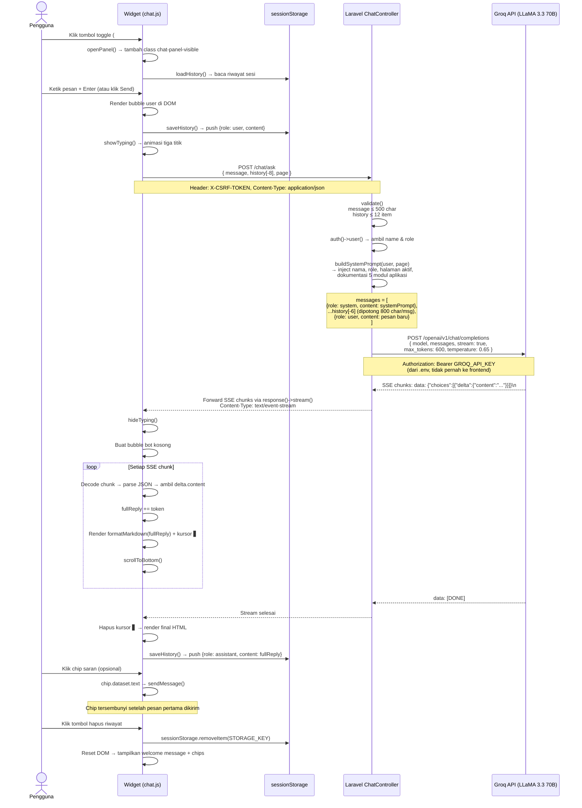

# Arsy — AI Customer Support Chat

Dokumentasi alur kerja lengkap fitur live chat berbasis AI pada aplikasi **E-Arsip SMA Babussalam**.

---

## 1. Gambaran Umum

Arsy adalah widget chat floating yang tertanam di setiap halaman (setelah login). Pengguna dapat mengajukan pertanyaan tentang cara penggunaan aplikasi, dan Arsy akan menjawab secara real-time menggunakan streaming SSE (*Server-Sent Events*) yang didukung oleh model **LLaMA 3.3 70B** melalui **Groq API**.

```
Pengguna  ──►  Browser (chat.js)  ──►  Laravel (ChatController)  ──►  Groq API
                                                                          │
                           SSE stream ◄──────────────────────────────────┘
```

---

## 2. Komponen Sistem

| Komponen | File | Peran |
|---|---|---|
| **Widget HTML** | `resources/views/partials/chat-widget.blade.php` | Struktur DOM panel chat |
| **JavaScript** | `resources/js/chat.js` | Toggle, streaming reader, history, UI |
| **CSS** | `public/css/chat.css` | Styling widget + dark mode |
| **Controller** | `app/Http/Controllers/ChatController.php` | Validasi, bangun prompt, stream ke Groq |
| **Route** | `routes/web.php` | `POST /chat/ask` dengan throttle 30 req/menit |
| **Layout** | `resources/views/layouts/app.blade.php` | Inject widget + aset ke semua halaman |

---

## 3. Sequence Diagram — Alur Lengkap



---

## 4. Bagaimana AI Mendapatkan Konteks

Konteks AI dibangun sepenuhnya di sisi server dalam fungsi `buildSystemPrompt()` sebelum dikirim ke Groq. AI **tidak pernah** membaca database secara langsung — semua konteks dimasukkan ke dalam **system prompt** sebagai teks terstruktur.

### 4.1 Sumber Konteks

```
┌─────────────────────────────────────────────────────────────┐
│                      SYSTEM PROMPT                          │
│                                                             │
│  [1] Identitas Bot                                          │
│      → Nama "Arsy", peran sebagai asisten E-Arsip           │
│      → Aturan: hanya jawab tentang aplikasi ini             │
│                                                             │
│  [2] Informasi Pengguna (dari auth()->user())               │
│      → Nama: "Ahmad Fauzan"                                 │
│      → Role: "Kepala Staf" / "Staf"                         │
│      → Halaman aktif: "/surat", "/laporan", dll.            │
│                                                             │
│  [3] Dokumentasi Aplikasi (hardcoded, selalu tersedia)      │
│      → Modul 1: Surat — cara tambah, edit, hapus, filter    │
│      → Modul 2: Siswa — data siswa, dokumen, status          │
│      → Modul 3: Kode Surat — master kode surat keluar       │
│      → Modul 4: Laporan — rekap, export PDF/Excel/Word      │
│      → Modul 5: User — hanya Kepala Staf, manajemen akun    │
│      → Dashboard — statistik dan grafik                     │
│      → Navigasi & breadcrumb                                │
│                                                             │
│  [4] Riwayat Percakapan (dari sessionStorage via request)   │
│      → Maks 6 pesan terakhir dikirim ke API                 │
│      → Setiap pesan dipotong maks 800 karakter              │
│      → Memungkinkan AI "mengingat" percakapan sebelumnya    │
│                                                             │
│  [5] Pesan User Terbaru                                     │
│      → Pertanyaan yang baru saja dikirim                    │
└─────────────────────────────────────────────────────────────┘
```

### 4.2 Alur Pembangunan Konteks

```
auth()->user()
    │
    ├── name  ──────────────────────────────────────────────►┐
    │                                                         │
    └── role()->name  ──────────────────────────────────────►│
                                                             │
$request->get('page')  ────────────────────────────────────►│
    (dikirim dari window.location.pathname di chat.js)       │
                                                             ▼
                                               buildSystemPrompt()
                                                      │
                                                      ▼
                                         string $systemPrompt (±2.5KB)

$request->input('history', [])
    │
    ├── array_slice(-6)  → ambil 6 pesan terakhir
    ├── validasi role (hanya 'user' / 'assistant')
    └── mb_substr(800)   → potong pesan panjang
          │
          ▼
    [...history messages]

$request->message  ──────────────────────────────────────────►┐
                                                               │
                                                               ▼
                                         $messages = [
                                           [system, $systemPrompt],
                                           [...history],
                                           [user, $newMessage]
                                         ]
                                                │
                                                ▼
                                          Groq API call
```

### 4.3 Personalisasi Berdasarkan Role

AI menyesuaikan jawaban berdasarkan role pengguna yang disisipkan ke system prompt:

| Role | Perilaku AI |
|---|---|
| **Kepala Staf** | Bisa menjelaskan modul User Management, statistik lengkap dashboard |
| **Staf** | Fokus pada Surat, Siswa, Laporan; tidak menjelaskan manajemen akun |

---

## 5. Manajemen Riwayat Percakapan

```
Browser (sessionStorage)                 Server (per-request)
─────────────────────────                ────────────────────
key: "earsip_arsy_history"               Tidak ada state server
                                         (stateless — tiap request bawa history)
Maks simpan: 20 pesan
                                         Maks kirim ke Groq: 6 pesan
Format:                                  Pemotongan: 800 char/pesan
[
  { role: "user",      content: "..." },
  { role: "assistant", content: "..." },
  ...
]

Lifetime: satu sesi tab (hilang saat tab/browser ditutup)
Reset:    tombol hapus riwayat → sessionStorage.removeItem()
```

---

## 6. Streaming SSE — Detail Teknis

### Sisi Server (PHP)

```php
return response()->stream(function () use ($messages) {
    $ch = curl_init('https://api.groq.com/openai/v1/chat/completions');
    curl_setopt($ch, CURLOPT_WRITEFUNCTION, function ($ch, $chunk) {
        echo $chunk;          // forward langsung ke browser
        ob_flush(); flush();  // paksa buffer keluar segera
        return strlen($chunk);
    });
    curl_exec($ch);
}, 200, [
    'Content-Type'      => 'text/event-stream',
    'Cache-Control'     => 'no-cache',
    'X-Accel-Buffering' => 'no',   // matikan buffering Nginx
    'Connection'        => 'keep-alive',
]);
```

Chunk dari Groq langsung di-forward ke browser tanpa buffering penuh — ini yang membuat teks muncul kata per kata.

### Sisi Client (JavaScript)

```
fetch('/chat/ask') → ReadableStream
    │
    └── getReader()
          │
          └── loop: reader.read()
                │
                ├── decode(value) → string chunk
                ├── split('\n') → per baris SSE
                ├── filter baris 'data: ...'
                ├── skip 'data: [DONE]'
                ├── JSON.parse(data)
                ├── ambil choices[0].delta.content
                └── append ke fullReply → render HTML
```

Format satu chunk dari Groq:
```
data: {"id":"...","choices":[{"delta":{"content":"Cara "},"index":0}]}\n\n
data: {"id":"...","choices":[{"delta":{"content":"menambah "},"index":0}]}\n\n
data: [DONE]\n\n
```

---

## 7. Keamanan

| Aspek | Implementasi |
|---|---|
| **CSRF** | Setiap request wajib header `X-CSRF-TOKEN` dari `<meta name="csrf-token">` |
| **Autentikasi** | Route `/chat/ask` di dalam middleware `auth` — tidak bisa diakses tanpa login |
| **Rate Limiting** | `throttle:30,1` — maks 30 request per menit per pengguna |
| **API Key** | `GROQ_API_KEY` hanya dibaca di server via `env()`, tidak pernah dikirim ke frontend |
| **Input Sanitasi** | `validate()` membatasi `message` ≤ 500 char, `history` ≤ 12 item |
| **Output Sanitasi** | `escapeHtml()` di frontend sebelum render — XSS tidak bisa masuk via konten AI |
| **History Truncation** | Tiap pesan history dipotong 800 char untuk cegah prompt injection panjang |

---

## 8. Batasan & Pertimbangan

- **Konteks statis**: Dokumentasi aplikasi di system prompt adalah hardcoded. Jika ada modul baru, `buildSystemPrompt()` harus diperbarui manual.
- **Tidak ada konteks data nyata**: AI tidak melihat isi database — tidak tahu daftar surat yang ada, tidak bisa membuat laporan. Ia hanya tahu *cara* menggunakan fitur.
- **Riwayat hilang saat logout**: Karena disimpan di `sessionStorage`, bukan database — privasi terjaga tapi tidak persisten.
- **Groq cold start**: Request pertama mungkin sedikit lebih lambat karena koneksi baru ke Groq API.
