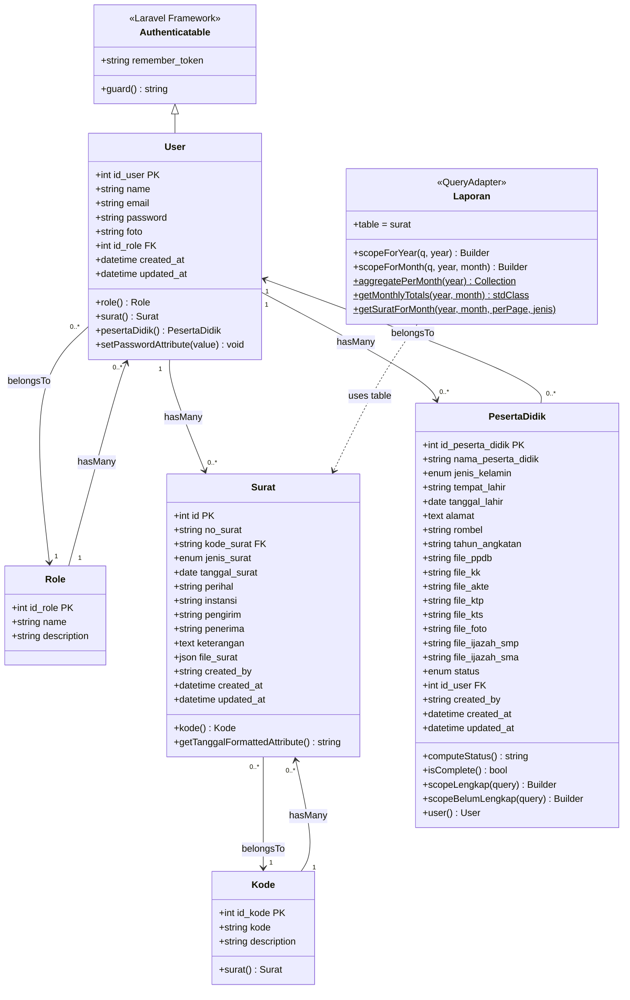

# Class Diagram — E-Arsip SMA Babussalam

Menggambarkan seluruh model Eloquent, atribut, method, dan relasi antar kelas.

---

---

## Keterangan Kelas

### `Role`
| Kolom | Tipe | Keterangan |
|---|---|---|
| `id_role` | `bigint` PK | Auto increment |
| `name` | `varchar(100)` | Nama role: "Kepala Staf" / "Staf" |
| `description` | `text` | Deskripsi role, nullable |

### `User`
| Kolom | Tipe | Keterangan |
|---|---|---|
| `id_user` | `bigint` PK | Auto increment |
| `name` | `varchar(150)` | Nama lengkap |
| `email` | `varchar(150)` | Unique |
| `password` | `varchar(255)` | Bcrypt hash — otomatis di-hash via mutator |
| `foto` | `varchar(255)` | Path foto profil, nullable |
| `id_role` | `bigint` FK | → `roles.id_role`, cascade delete |

**Method penting:**
- `setPasswordAttribute()` — mutator: otomatis bcrypt hash password sebelum disimpan, skip jika sudah di-hash atau kosong

### `Kode`
| Kolom | Tipe | Keterangan |
|---|---|---|
| `id_kode` | `bigint` PK | Auto increment |
| `kode` | `varchar(10)` | Unik (contoh: `S-U`, `S-P`) |
| `description` | `varchar(100)` | Deskripsi kode |

**Model event:**
- `updating` — jika kolom `kode` berubah, semua `surat.kode_surat` yang memakai nilai lama ikut diperbarui (cascade manual)

### `Surat`
| Kolom | Tipe | Keterangan |
|---|---|---|
| `id` | `bigint` PK | Auto increment |
| `no_surat` | `varchar(100)` | Nomor surat |
| `kode_surat` | `varchar(50)` FK | → `kode.kode`, nullable (hanya Surat Keluar) |
| `jenis_surat` | `enum` | `Masuk` / `Keluar` |
| `tanggal_surat` | `date` | Tanggal surat |
| `perihal` | `varchar(255)` | Perihal surat |
| `instansi` | `varchar(255)` | Asal/tujuan instansi |
| `pengirim` | `varchar(255)` | Nullable |
| `penerima` | `varchar(255)` | Nullable |
| `keterangan` | `text` | Nullable |
| `file_surat` | `json` | Array path file lampiran (cast ke `array`) |
| `created_by` | `varchar(100)` | Nama user pembuat (string, bukan FK) |

**Accessor:**
- `getTanggalFormattedAttribute()` — mengembalikan tanggal dalam format `d-m-Y`

### `PesertaDidik`
| Kolom | Tipe | Keterangan |
|---|---|---|
| `id_peserta_didik` | `bigint` PK | Auto increment |
| `nama_peserta_didik` | `varchar(150)` | Nama lengkap |
| `jenis_kelamin` | `enum` | `L` / `P` |
| `tempat_lahir` | `varchar(100)` | |
| `tanggal_lahir` | `date` | |
| `alamat` | `text` | |
| `rombel` | `varchar` | Contoh: `A` / `B` |
| `tahun_angkatan` | `varchar(10)` | Contoh: `2023` |
| `file_ppdb` | `varchar` | Nullable |
| `file_kk` | `varchar` | Nullable |
| `file_akte` | `varchar` | Nullable |
| `file_ktp` | `varchar` | Nullable |
| `file_kts` | `varchar` | Nullable |
| `file_foto` | `varchar` | Nullable |
| `file_ijazah_smp` | `varchar` | Nullable |
| `file_ijazah_sma` | `varchar` | Nullable — **opsional**, tidak dihitung dalam `computeStatus()` |
| `status` | `enum` | `lengkap` / `belum lengkap`, dihitung otomatis |
| `id_user` | `bigint` FK | → `users.id_user` |
| `created_by` | `varchar(150)` | Nama user pembuat (string, bukan FK) |

**Model event:**
- `saving` — otomatis panggil `computeStatus()` sebelum setiap simpan

**Method penting:**
- `computeStatus()` — cek 7 file wajib (`file_ppdb`, `file_kk`, `file_akte`, `file_ktp`, `file_kts`, `file_foto`, `file_ijazah_smp`): jika semua terisi → `lengkap`, sebaliknya → `belum lengkap`. `file_ijazah_sma` **tidak** dihitung.
- `isComplete()` — shortcut boolean
- `scopeLengkap()` / `scopeBelumLengkap()` — query scope untuk filter status

### `Laporan`
Bukan entitas database tersendiri — ini adalah **query adapter** yang menunjuk ke tabel `surat` dengan method agregasi khusus untuk kebutuhan laporan.

| Method | Return | Keterangan |
|---|---|---|
| `scopeForYear()` | `Builder` | Filter berdasarkan tahun |
| `scopeForMonth()` | `Builder` | Filter berdasarkan bulan + tahun |
| `aggregatePerMonth()` | `Collection` | Rekap masuk/keluar per bulan dalam satu tahun |
| `getMonthlyTotals()` | `stdClass` | Total masuk + keluar dalam satu bulan |
| `getSuratForMonth()` | `Paginator` | Daftar surat paginated untuk bulan tertentu |

---

## Ringkasan Relasi

| Relasi | Tipe | Foreign Key |
|---|---|---|
| `Role` → `User` | One-to-Many | `users.id_role` → `roles.id_role` |
| `User` → `Surat` | One-to-Many | `surat.id_user` → `users.id_user` |
| `User` → `PesertaDidik` | One-to-Many | `peserta_didik.id_user` → `users.id_user` |
| `Kode` → `Surat` | One-to-Many | `surat.kode_surat` → `kode.kode` |
| `Laporan` → `Surat` | Uses Table | Bukan relasi Eloquent — query langsung |
