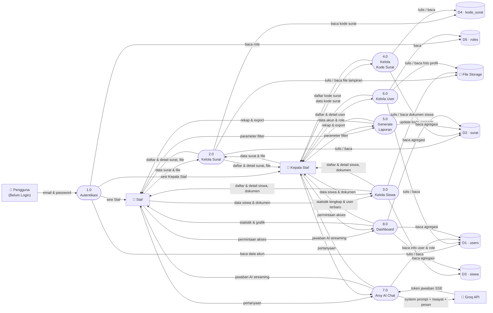

# DFD Level 1 — E-Arsip SMA Babussalam

Dekomposisi proses tunggal dari diagram konteks menjadi 8 proses utama beserta data store internal dan aliran datanya.

---



---

## Alur Autentikasi — Penjelasan

```
Pengguna (belum login)
        │
        │  email + password
        ▼
   1.0 Autentikasi  ──── baca ────► D1 (users)
        │            ──── baca ────► D5 (roles)
        │
        ├──── role = Staf       ────► 👤 Staf
        └──── role = Kepala Staf────► 👤 Kepala Staf
```

Role baru ditentukan oleh proses autentikasi setelah membaca tabel `users` dan `roles`. Setelah sesi terbentuk, barulah entitas **Staf** atau **Kepala Staf** mengakses proses-proses lainnya.

---

## Daftar Proses

| ID | Proses | Deskripsi |
|---|---|---|
| **1.0** | Autentikasi | Verifikasi kredensial, tentukan role, buat sesi |
| **2.0** | Kelola Surat | CRUD surat masuk/keluar, upload/download file lampiran |
| **3.0** | Kelola Siswa | CRUD data siswa, upload/download 8 jenis dokumen |
| **4.0** | Kelola Kode Surat | CRUD kode klasifikasi surat keluar, cascade update ke surat |
| **5.0** | Generate Laporan | Rekap surat tahunan/bulanan, export PDF/Excel/Word |
| **6.0** | Kelola User | CRUD akun pengguna, assign role, upload foto profil |
| **7.0** | Arsy AI Chat | Terima pertanyaan, kirim ke Groq API, stream jawaban ke user |
| **8.0** | Dashboard | Agregasi statistik surat, siswa, user, dan grafik tren bulanan |

## Daftar Data Store

| ID | Nama | Tabel | Deskripsi |
|---|---|---|---|
| **D1** | users | `users` | Data akun pengguna beserta relasi ke role |
| **D2** | surat | `surats` | Data surat masuk dan keluar beserta metadata |
| **D3** | siswa | `siswas` | Data pribadi siswa dan path file 8 dokumen |
| **D4** | kode_surat | `kode_surats` | Master kode klasifikasi surat keluar |
| **D5** | roles | `roles` | Daftar role: Kepala Staf, Staf |

## Catatan Aliran Data Khusus

| Aliran | Keterangan |
|---|---|
| **USR → P1** | Satu-satunya titik masuk ke sistem — semua pengguna wajib melewati autentikasi dulu |
| **P1 → D5** | Role dibaca dari tabel `roles` untuk menentukan hak akses sesi |
| **P4 → D2** (cascade) | Edit kode surat otomatis memperbarui semua record `surats` yang menggunakannya |
| **P7 → GROQ** | Membawa system prompt dinamis + max 6 pesan riwayat per request |
| **P8 → D1** | Hanya diakses jika sesi aktif adalah Kepala Staf (statistik user) |
