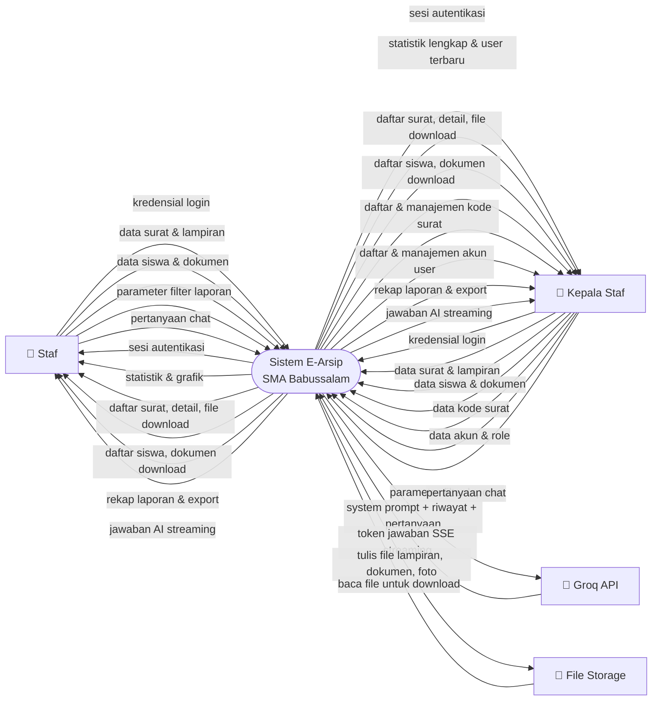

# Diagram Konteks (DFD Level 0) — E-Arsip SMA Babussalam

Menggambarkan sistem E-Arsip sebagai **satu proses tunggal** beserta seluruh entitas eksternal dan aliran data yang masuk maupun keluar.

---

---

## Entitas Eksternal

| Entitas | Tipe | Deskripsi |
|---|---|---|
| **Staf** | Pengguna | Akses operasional: surat, siswa, laporan, chat |
| **Kepala Staf** | Pengguna (Admin) | Akses penuh termasuk kode surat dan manajemen user |
| **Groq API** | Sistem Eksternal | Model LLaMA 3.3 70B untuk menjawab pertanyaan via Arsy |
| **File Storage** | Sistem Eksternal | Disk server untuk menyimpan lampiran surat, dokumen siswa, foto user |

## Aliran Data

| Dari | Ke | Data |
|---|---|---|
| Staf / Kepala Staf | Sistem | Kredensial, input form, file upload, pertanyaan chat |
| Sistem | Staf / Kepala Staf | Sesi, statistik, tabel data, file download, jawaban AI |
| Sistem | Groq API | System prompt + riwayat percakapan + pesan user |
| Groq API | Sistem | Token jawaban via SSE real-time |
| Sistem | File Storage | Tulis file lampiran surat, dokumen siswa, foto profil |
| File Storage | Sistem | Baca file untuk di-download pengguna |
