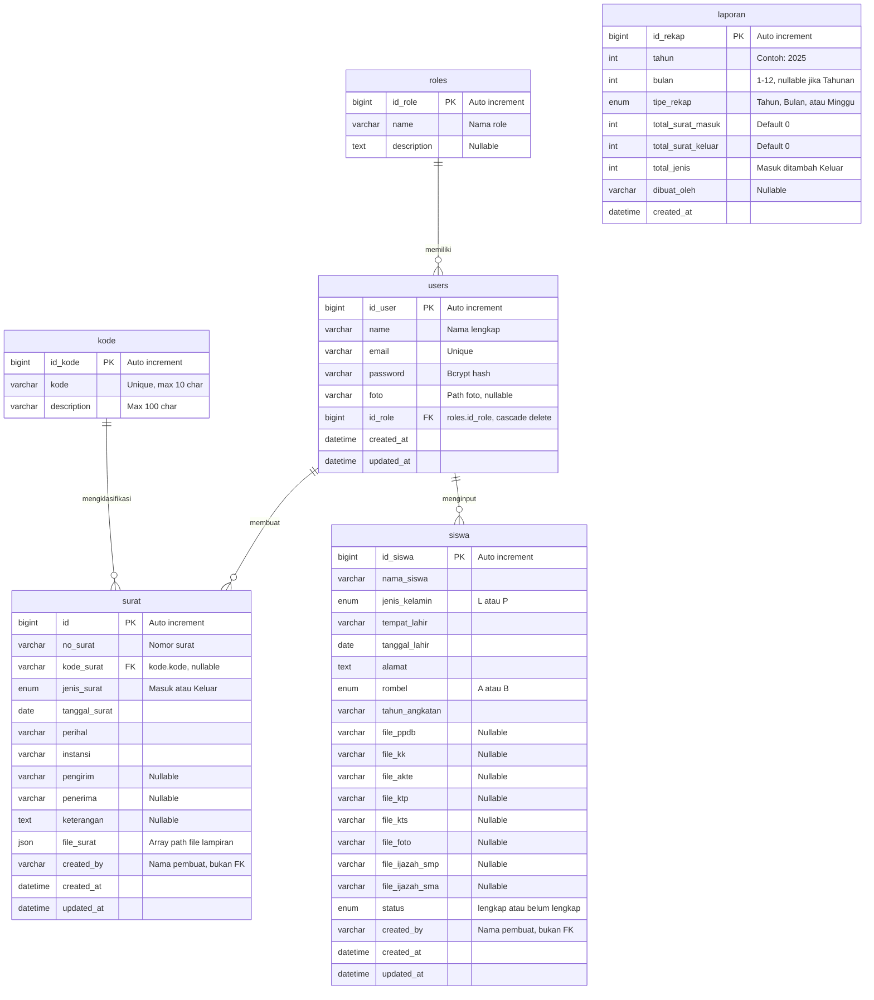

# ERD — E-Arsip SMA Babussalam

Entity Relationship Diagram seluruh tabel database aplikasi.

---

---

## Keterangan Relasi

| Relasi | Tipe | Foreign Key | On Delete |
|---|---|---|---|
| `roles` → `users` | One-to-Many | `users.id_role` → `roles.id_role` | CASCADE |
| `kode` → `surat` | One-to-Many | `surat.kode_surat` → `kode.kode` | SET NULL via model event |
| `users` → `surat` | One-to-Many | `surat.created_by` ← nama string | — (bukan FK di DB) |
| `users` → `siswa` | One-to-Many | `siswa.created_by` ← nama string | — (bukan FK di DB) |

## Catatan Desain

| Aspek | Keterangan |
|---|---|
| **`surat.kode_surat`** | FK ke `kode.kode` (string), bukan ke `kode.id_kode`. Cascade update dilakukan manual via model event `updating` pada `Kode`, bukan constraint DB |
| **`created_by`** | Kolom `surat.created_by` dan `siswa.created_by` menyimpan nama user sebagai string, bukan `id_user` — tidak ada referential integrity |
| **`surat.file_surat`** | Kolom `json` yang di-cast ke `array` oleh Eloquent. Tidak ada tabel terpisah untuk lampiran |
| **`siswa.file_*`** | 8 kolom terpisah per jenis dokumen. Status `lengkap`/`belum lengkap` dihitung otomatis via model event `saving` |
| **`laporan`** | Tabel snapshot rekap. Model `Laporan` di Laravel tidak membaca tabel ini — ia query langsung ke tabel `surat` |
