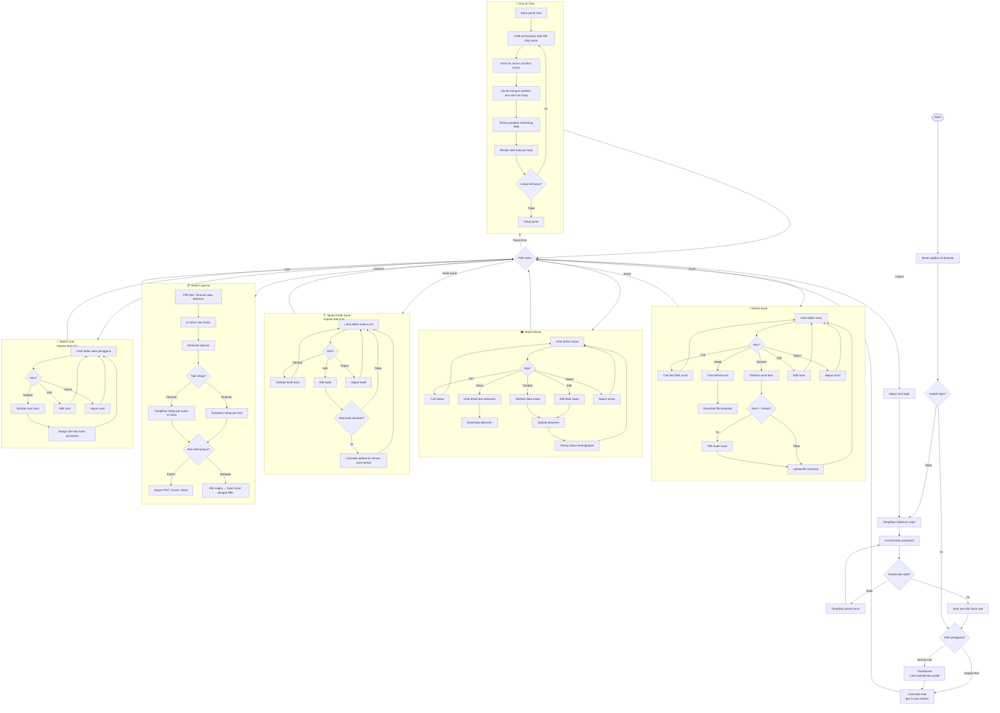

# Flowchart General — E-Arsip SMA Babussalam

Alur umum penggunaan aplikasi dari awal akses hingga logout.

---

```mermaid
flowchart TD
    START([Mulai]) --> F1

    F1[Akses aplikasi di browser]
    F2{Sudah login?}
    F3[Tampilkan halaman Login]
    F4[Isi email dan password]
    F5{Kredensial valid?}
    F6[Tampilkan pesan error]
    F7[Buat sesi dan baca role]
    F8{Role pengguna?}

    F1 --> F2
    F2 -->|Tidak| F3 --> F4 --> F5
    F5 -->|Tidak| F6 --> F4
    F5 -->|Ya| F7 --> F8
    F2 -->|Ya| F8

    %% ── DASHBOARD ─────────────────────────────────────
    F8 -->|Semua role| DASH

    DASH[Dashboard\nLihat statistik dan grafik]
    F8 -->|Kepala Staf| DASH_EXTRA[Lihat total user\ndan 5 user terbaru]
    DASH --> DASH_EXTRA
    DASH_EXTRA --> NAV

    %% ── NAVIGASI UTAMA ────────────────────────────────
    NAV{Pilih menu}

    NAV -->|Surat| MOD_SURAT
    NAV -->|Siswa| MOD_SISWA
    NAV -->|Kode Surat| MOD_KODE
    NAV -->|Laporan| MOD_LAP
    NAV -->|User| MOD_USER
    NAV -->|Tanya Arsy| MOD_ARSY
    NAV -->|Logout| LOGOUT

    %% ── MODUL SURAT ───────────────────────────────────
    subgraph MOD_SURAT["📨 Modul Surat"]
        direction TD
        S1[Lihat daftar surat]
        S2{Aksi?}
        S3[Cari dan filter surat]
        S4[Lihat detail surat]
        S5[Tambah surat baru]
        S6{Jenis = Keluar?}
        S7[Pilih kode surat]
        S8[Upload file lampiran]
        S9[Edit surat]
        S10[Hapus surat]
        S11[Download file lampiran]

        S1 --> S2
        S2 -->|Cari| S3 --> S1
        S2 -->|Detail| S4 --> S11
        S2 -->|Tambah| S5 --> S6
        S6 -->|Ya| S7 --> S8 --> S1
        S6 -->|Tidak| S8
        S2 -->|Edit| S9 --> S1
        S2 -->|Hapus| S10 --> S1
    end

    %% ── MODUL SISWA ───────────────────────────────────
    subgraph MOD_SISWA["🎓 Modul Siswa"]
        direction TD
        SW1[Lihat daftar siswa]
        SW2{Aksi?}
        SW3[Cari siswa]
        SW4[Lihat detail dan dokumen]
        SW5[Tambah data siswa]
        SW6[Upload dokumen]
        SW7[Hitung status kelengkapan]
        SW8[Edit data siswa]
        SW9[Hapus siswa]
        SW10[Download dokumen]

        SW1 --> SW2
        SW2 -->|Cari| SW3 --> SW1
        SW2 -->|Detail| SW4 --> SW10
        SW2 -->|Tambah| SW5 --> SW6 --> SW7 --> SW1
        SW2 -->|Edit| SW8 --> SW6
        SW2 -->|Hapus| SW9 --> SW1
    end

    %% ── MODUL KODE SURAT ──────────────────────────────
    subgraph MOD_KODE["🏷️ Modul Kode Surat\nKepala Staf only"]
        direction TD
        K1[Lihat daftar kode surat]
        K2{Aksi?}
        K3[Tambah kode baru]
        K4[Edit kode]
        K5{Nilai kode berubah?}
        K6[Cascade update ke semua surat terkait]
        K7[Hapus kode]

        K1 --> K2
        K2 -->|Tambah| K3 --> K1
        K2 -->|Edit| K4 --> K5
        K5 -->|Ya| K6 --> K1
        K5 -->|Tidak| K1
        K2 -->|Hapus| K7 --> K1
    end

    %% ── MODUL LAPORAN ─────────────────────────────────
    subgraph MOD_LAP["📋 Modul Laporan"]
        direction TD
        L1[Pilih tipe: Tahunan atau Bulanan]
        L2[Isi tahun dan bulan]
        L3[Generate laporan]
        L4{Tipe rekap?}
        L5[Tampilkan rekap per bulan 12 baris]
        L6[Tampilkan rekap per hari]
        L7{Aksi selanjutnya?}
        L8[Export PDF / Excel / Word]
        L9[Klik angka → buka Surat dengan filter]

        L1 --> L2 --> L3 --> L4
        L4 -->|Tahunan| L5 --> L7
        L4 -->|Bulanan| L6 --> L7
        L7 -->|Export| L8
        L7 -->|Navigasi| L9
    end

    %% ── MODUL USER ────────────────────────────────────
    subgraph MOD_USER["👥 Modul User\nKepala Staf only"]
        direction TD
        U1[Lihat daftar akun pengguna]
        U2{Aksi?}
        U3[Tambah user baru]
        U4[Assign role dan hash password]
        U5[Edit user]
        U6[Hapus user]

        U1 --> U2
        U2 -->|Tambah| U3 --> U4 --> U1
        U2 -->|Edit| U5 --> U1
        U2 -->|Hapus| U6 --> U1
    end

    %% ── ARSY AI CHAT ──────────────────────────────────
    subgraph MOD_ARSY["💬 Arsy AI Chat"]
        direction TD
        A1[Buka panel chat]
        A2[Ketik pertanyaan atau klik chip saran]
        A3[Kirim ke server via fetch POST]
        A4[Server bangun konteks dan kirim ke Groq]
        A5[Terima jawaban streaming SSE]
        A6[Render teks kata per kata]
        A7{Lanjut bertanya?}
        A8[Tutup panel]

        A1 --> A2 --> A3 --> A4 --> A5 --> A6 --> A7
        A7 -->|Ya| A2
        A7 -->|Tidak| A8
    end

    %% ── LOGOUT ────────────────────────────────────────
    LOGOUT[Hapus sesi login]
    LOGOUT --> F3

    %% ── KEMBALI KE NAVIGASI ───────────────────────────
    MOD_SURAT --> NAV
    MOD_SISWA --> NAV
    MOD_KODE  --> NAV
    MOD_LAP   --> NAV
    MOD_USER  --> NAV
    MOD_ARSY  --> NAV
```
