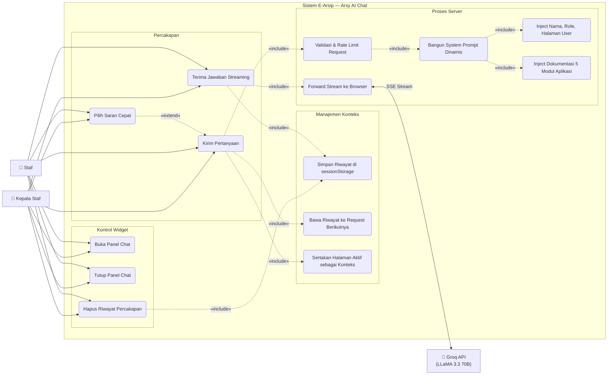

# Use Case — Arsy AI Chat Support

Widget live chat berbasis AI yang tersedia di seluruh halaman aplikasi untuk membantu pengguna.

---

---

## Deskripsi Use Case

| Use Case | Aktor | Deskripsi |
|---|---|---|
| **Buka Panel Chat** | Staf, Kepala Staf | Klik tombol toggle → panel muncul dengan animasi slide-in |
| **Tutup Panel Chat** | Staf, Kepala Staf | Klik × atau tombol toggle → panel tersembunyi |
| **Hapus Riwayat** | Staf, Kepala Staf | Bersihkan `sessionStorage` dan reset DOM ke pesan selamat datang |
| **Kirim Pertanyaan** | Staf, Kepala Staf | Ketik pesan + Enter atau klik tombol kirim |
| **Pilih Saran Cepat** | Staf, Kepala Staf | Klik chip preset (muncul hanya sebelum pesan pertama) |
| **Terima Jawaban Streaming** | Staf, Kepala Staf | Teks AI muncul kata per kata via SSE (bukan tunggu respons penuh) |
| **Simpan Riwayat** | Sistem | Push pesan user & AI ke `sessionStorage` setelah setiap respons |
| **Bawa Riwayat ke Request** | Sistem | Max 8 pesan terakhir dikirim ke server untuk konteks multi-turn |
| **Sertakan Halaman Aktif** | Sistem | `window.location.pathname` dikirim agar AI tahu konteks halaman |
| **Validasi & Rate Limit** | Sistem | Max 500 char/pesan, throttle 30 req/menit per user via Laravel |
| **Bangun System Prompt** | Sistem | Gabungkan identitas bot + info user + dokumentasi 5 modul |
| **Inject Info User** | Sistem | Nama & role dari `auth()->user()` masuk ke system prompt |
| **Inject Dokumentasi Modul** | Sistem | Hardcoded docs Surat, Siswa, Kode, Laporan, User, Dashboard |
| **Forward Stream** | Sistem | PHP curl `WRITEFUNCTION` forward SSE chunk langsung ke browser |

## Saran Cepat Tersedia

| Chip | Teks yang Dikirim |
|---|---|
| Tambah surat | "Cara tambah surat baru?" |
| Export laporan | "Cara export laporan ke PDF?" |
| Dokumen siswa | "Cara upload dokumen siswa?" |
| Fitur aplikasi | "Apa saja fitur di aplikasi ini?" |

## Aturan Bisnis

- Widget tersedia di **semua halaman** setelah login (dirender via `app.blade.php`)
- Riwayat chat bersifat **per-sesi tab** — hilang saat tab ditutup (privacy-first)
- AI hanya menjawab tentang E-Arsip — pertanyaan di luar topik ditolak dengan sopan
- Jawaban AI disesuaikan dengan **role** pengguna (Staf vs Kepala Staf)
- API Key Groq **tidak pernah dikirim ke browser** — hanya diakses server-side via `env()`
