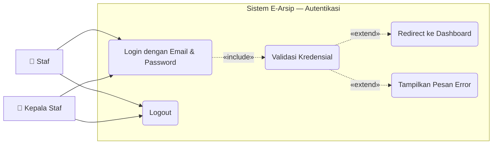

# Use Case — Autentikasi

Modul login/logout yang menjadi gerbang masuk ke seluruh fitur E-Arsip.

---

---

## Deskripsi Use Case

| Use Case | Aktor | Deskripsi |
|---|---|---|
| **Login dengan Email & Password** | Staf, Kepala Staf | Mengisi form login dan submit |
| **Validasi Kredensial** | Sistem | Cek email + password ke tabel `users` |
| **Redirect ke Dashboard** | Sistem | Jika valid → arahkan ke `/dashboard` |
| **Tampilkan Pesan Error** | Sistem | Jika gagal → tampilkan pesan kesalahan |
| **Logout** | Staf, Kepala Staf | Mengakhiri sesi dan kembali ke halaman login |

## Aturan Bisnis

- Email harus terdaftar di tabel `users`
- Password divalidasi menggunakan `bcrypt`
- Semua halaman (kecuali `/login`) dilindungi middleware `auth`
- Sesi dikelola oleh Laravel session driver
