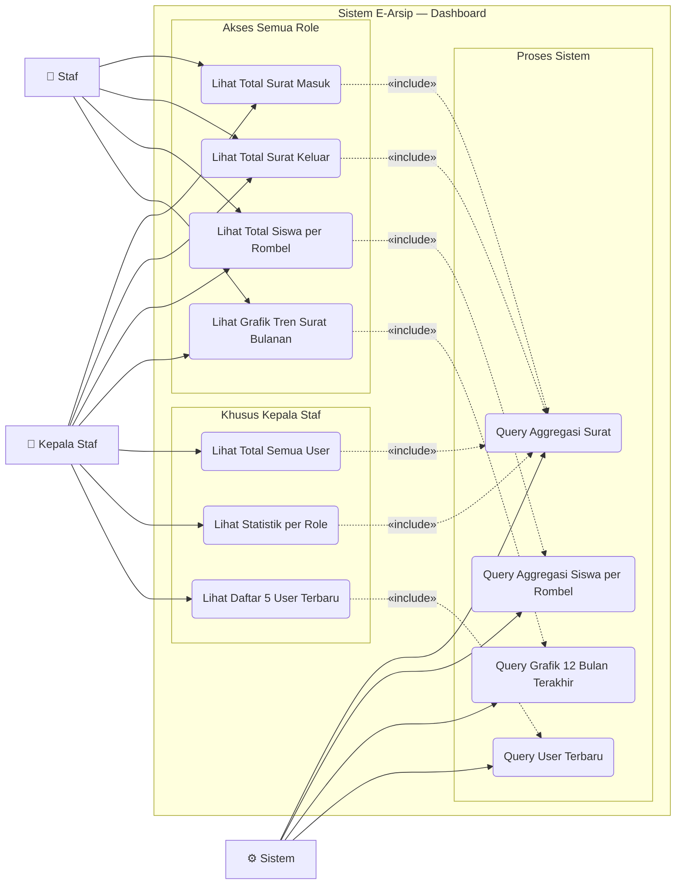

# Use Case — Dashboard

Halaman beranda yang menampilkan statistik dan ringkasan data aplikasi.

---

---

## Deskripsi Use Case

| Use Case | Aktor | Deskripsi |
|---|---|---|
| **Lihat Total Surat Masuk** | Staf, Kepala Staf | Kartu statistik jumlah total surat masuk |
| **Lihat Total Surat Keluar** | Staf, Kepala Staf | Kartu statistik jumlah total surat keluar |
| **Lihat Total Siswa per Rombel** | Staf, Kepala Staf | Kartu statistik jumlah siswa rombel A dan B |
| **Lihat Grafik Tren Surat Bulanan** | Staf, Kepala Staf | Chart line surat masuk & keluar per bulan dalam tahun berjalan |
| **Lihat Total Semua User** | Kepala Staf | Kartu statistik total akun pengguna (kolom ke-5) |
| **Lihat Statistik per Role** | Kepala Staf | Breakdown jumlah Kepala Staf vs Staf |
| **Lihat 5 User Terbaru** | Kepala Staf | Tabel user yang paling baru dibuat (nama, role, waktu) |

## Perbedaan Tampilan Berdasarkan Role

| Elemen | Staf | Kepala Staf |
|---|---|---|
| Kartu statistik surat | ✅ 2 kartu | ✅ 2 kartu |
| Kartu statistik siswa | ✅ 2 kartu (Rombel A + B) | ✅ 2 kartu (Rombel A + B) |
| Kartu statistik user | ❌ | ✅ 1 kartu |
| Grafik tren surat | ✅ | ✅ |
| Tabel user terbaru | ❌ | ✅ |
| Total kartu di baris atas | 4 kartu | 5 kartu |
