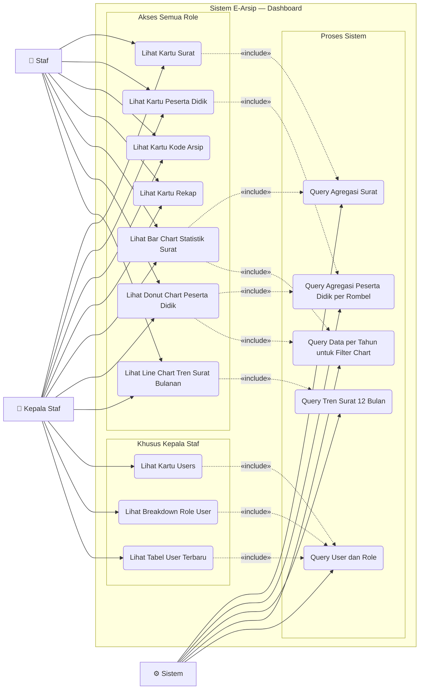

# Use Case — Dashboard

Halaman beranda yang menampilkan statistik dan ringkasan data aplikasi.

---

---

## Deskripsi Use Case

| Use Case | Aktor | Deskripsi |
|---|---|---|
| **Lihat Kartu Surat** | Staf, Kepala Staf | Kartu menampilkan total surat dengan badge masuk & keluar (clickable link) |
| **Lihat Kartu Peserta Didik** | Staf, Kepala Staf | Kartu menampilkan total peserta didik dengan badge per rombel dan badge L/P |
| **Lihat Kartu Kode Arsip** | Staf, Kepala Staf | Kartu menampilkan total kode arsip yang terdaftar |
| **Lihat Kartu Rekap** | Staf, Kepala Staf | Shortcut ke halaman laporan (bukan angka statistik) |
| **Lihat Bar Chart Statistik Surat** | Staf, Kepala Staf | Bar chart perbandingan surat masuk vs keluar dengan filter input tahun |
| **Lihat Donut Chart Peserta Didik** | Staf, Kepala Staf | Donut chart distribusi per rombel dengan filter tahun angkatan dan badge gender L/P |
| **Lihat Line Chart Tren Surat Bulanan** | Staf, Kepala Staf | Line chart tren 12 bulan tahun berjalan, dua garis (masuk & keluar) |
| **Lihat Kartu Users** | Kepala Staf | Kartu menampilkan total user dengan breakdown Kepala Staf vs Staf |
| **Lihat Breakdown Role User** | Kepala Staf | Informasi jumlah per role di dalam kartu Users |
| **Lihat Tabel User Terbaru** | Kepala Staf | Tabel user yang paling baru dibuat (nama, role, waktu) |

## Perbedaan Tampilan Berdasarkan Role

| Elemen | Staf | Kepala Staf |
|---|---|---|
| Kartu Surat | ✅ | ✅ |
| Kartu Peserta Didik | ✅ | ✅ |
| Kartu Kode Arsip | ✅ | ✅ |
| Kartu Rekap | ✅ | ✅ |
| Kartu Users | ❌ | ✅ |
| Bar Chart Statistik Surat | ✅ | ✅ |
| Donut Chart Peserta Didik | ✅ | ✅ |
| Line Chart Tren Surat Bulanan | ✅ | ✅ |
| Tabel user terbaru | ❌ | ✅ |
| Total kartu di baris atas | 4 kartu | 5 kartu |
