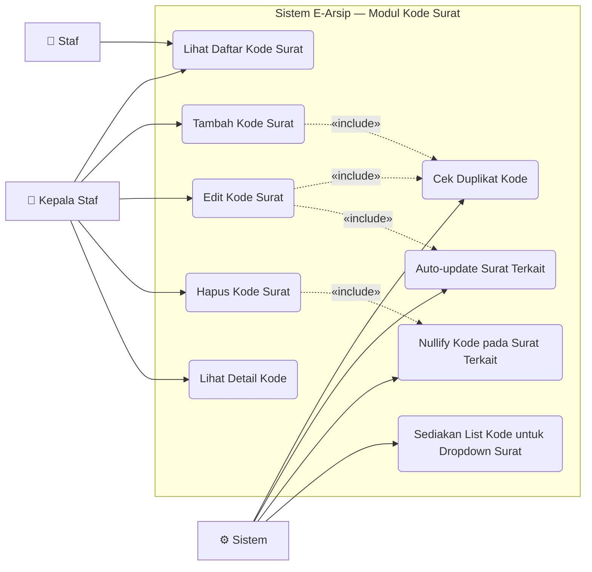

# Use Case — Modul Kode Surat

Master data kode klasifikasi untuk surat keluar. Wajib diisi sebelum membuat surat keluar.

---

---

## Deskripsi Use Case

| Use Case | Aktor | Deskripsi |
|---|---|---|
| **Lihat Daftar Kode Surat** | Staf, Kepala Staf | Tabel kode surat (read-only untuk Staf) |
| **Tambah Kode Surat** | Kepala Staf | Form: kode (maks 10 char, unik) + deskripsi |
| **Edit Kode Surat** | Kepala Staf | Ubah kode atau deskripsi |
| **Hapus Kode Surat** | Kepala Staf | Hapus kode dari master data |
| **Lihat Detail Kode** | Kepala Staf | Lihat detail satu kode beserta surat yang menggunakannya |
| **Cek Duplikat Kode** | Sistem | Validasi keunikan kode via AJAX real-time saat input |
| **Auto-update Surat Terkait** | Sistem | Jika kode diubah → semua surat keluar yang pakai kode lama ikut diperbarui |
| **Nullify Kode pada Surat** | Sistem | Jika kode dihapus → field kode pada surat terkait menjadi `null` |
| **Sediakan List untuk Dropdown** | Sistem | Endpoint `/surat/kode-surat-keluar` → JSON list kode aktif untuk form surat |

## Aturan Bisnis

- Hanya **Kepala Staf** (`id_role = 1`) yang bisa tambah/edit/hapus kode
- Kode bersifat unik, maks **10 karakter** (contoh: `S-U`, `S-P`, `S-T`)
- Perubahan kode bersifat **cascade** ke seluruh surat keluar yang menggunakannya
- Penghapusan kode **tidak** menghapus surat — hanya memutus relasi (set `null`)
- Kode ini hanya berlaku untuk **Surat Keluar**, Surat Masuk tidak memerlukan kode
