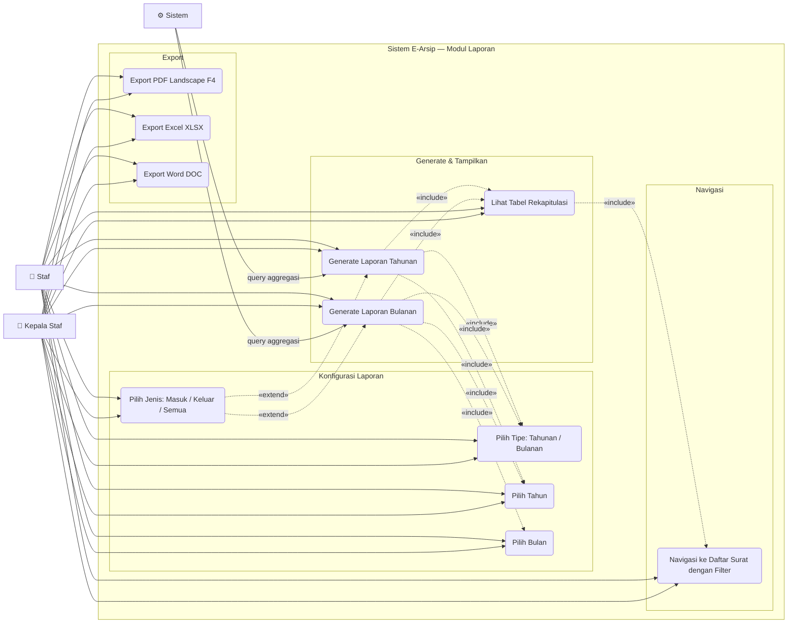

# Use Case — Modul Laporan

Rekap statistik surat masuk dan keluar dengan kemampuan export ke berbagai format.

---

---

## Deskripsi Use Case

| Use Case | Aktor | Deskripsi |
|---|---|---|
| **Pilih Tipe Tahunan/Bulanan** | Staf, Kepala Staf | Toggle antara rekap per bulan (tahunan) atau rekap per hari (bulanan) |
| **Pilih Tahun** | Staf, Kepala Staf | Input tahun (contoh: 2026) |
| **Pilih Bulan** | Staf, Kepala Staf | Hanya aktif jika tipe = Bulanan (1–12) |
| **Pilih Jenis** | Staf, Kepala Staf | Filter opsional: Masuk / Keluar / Semua |
| **Generate Laporan Tahunan** | Staf, Kepala Staf | Tabel 12 bulan × (masuk, keluar, total) untuk satu tahun |
| **Generate Laporan Bulanan** | Staf, Kepala Staf | Tabel per hari × (masuk, keluar, total) untuk satu bulan |
| **Lihat Tabel Rekapitulasi** | Staf, Kepala Staf | Tampilkan hasil rekap dengan baris total di bagian bawah |
| **Export PDF** | Staf, Kepala Staf | Generate PDF ukuran F4 landscape via DomPDF |
| **Export Excel** | Staf, Kepala Staf | Download file `.xlsx` via Maatwebsite Excel |
| **Export Word** | Staf, Kepala Staf | Download file `.doc` |
| **Navigasi ke Daftar Surat** | Staf, Kepala Staf | Klik angka pada tabel → buka `/surat?jenis_surat=X&bulan=Y&tahun=Z` |

## Aturan Bisnis

- Laporan Tahunan: wajib isi **Tahun** saja
- Laporan Bulanan: wajib isi **Tahun** + **Bulan**
- Navigasi ke Surat mempertahankan filter bulan & tahun di URL agar tabel surat langsung terfilter
- Export menggunakan filter yang sedang aktif (bukan seluruh data)
