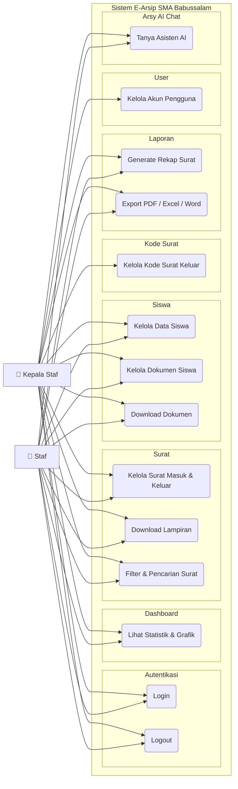

# Use Case — Overview E-Arsip SMA Babussalam

Gambaran umum seluruh fitur aplikasi E-Arsip.

---

---

## Ringkasan Akses per Role

| Fitur | Staf | Kepala Staf |
|---|:---:|:---:|
| Login / Logout | ✅ | ✅ |
| Dashboard | ✅ (terbatas) | ✅ (penuh) |
| Surat | ✅ | ✅ |
| Siswa | ✅ | ✅ |
| Kode Surat | ❌ | ✅ |
| Laporan | ✅ | ✅ |
| User | ❌ | ✅ |
| Arsy AI Chat | ✅ | ✅ |
