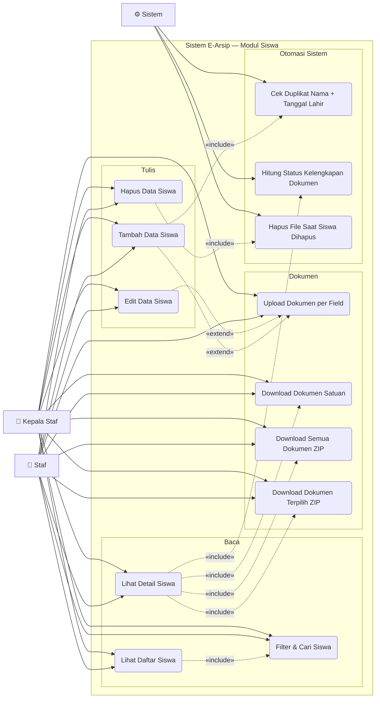

# Use Case — Modul Siswa

Mengelola data pribadi siswa dan dokumen pendaftaran/pendidikan mereka.

---

---

## Deskripsi Use Case

| Use Case | Aktor | Deskripsi |
|---|---|---|
| **Lihat Daftar Siswa** | Staf, Kepala Staf | Tabel siswa dengan pagination dan badge status kelengkapan |
| **Lihat Detail Siswa** | Staf, Kepala Staf | Modal detail berisi data pribadi + daftar 8 jenis dokumen |
| **Filter & Cari Siswa** | Staf, Kepala Staf | Cari berdasarkan nama, NIS, rombel, angkatan |
| **Tambah Data Siswa** | Staf, Kepala Staf | Form: nama, TTL, jenis kelamin, angkatan, rombel, alamat |
| **Edit Data Siswa** | Staf, Kepala Staf | Ubah data pribadi dan upload/hapus dokumen |
| **Hapus Data Siswa** | Staf, Kepala Staf | Hapus siswa beserta semua file dari storage |
| **Upload Dokumen per Field** | Staf, Kepala Staf | Upload per jenis: PPDB, KK, Akte, KTP, KTS, Foto, Ijazah SMP, Ijazah SMA |
| **Download Dokumen Satuan** | Staf, Kepala Staf | Unduh satu file dokumen |
| **Download Semua Dokumen ZIP** | Staf, Kepala Staf | Zip seluruh dokumen satu siswa |
| **Download Dokumen Terpilih ZIP** | Staf, Kepala Staf | Zip dokumen yang dicentang |
| **Cek Duplikat** | Sistem | Deteksi siswa ganda berdasarkan nama + tanggal lahir via AJAX |
| **Hitung Status Kelengkapan** | Sistem | "Lengkap" jika semua 8 file ada, "Belum Lengkap" jika ada yang kosong |
| **Hapus File Saat Dihapus** | Sistem | Otomatis hapus semua file dari disk saat record siswa dihapus |

## 8 Jenis Dokumen Siswa

| # | Nama Field | Keterangan |
|---|---|---|
| 1 | `ppdb` | Formulir PPDB |
| 2 | `kk` | Kartu Keluarga |
| 3 | `akte` | Akta Kelahiran |
| 4 | `ktp` | KTP Orang Tua |
| 5 | `kts` | Kartu Tanda Siswa |
| 6 | `foto` | Pas Foto |
| 7 | `ijazah_smp` | Ijazah SMP/MTs |
| 8 | `ijazah_sma` | Ijazah SMA (saat lulus) |
