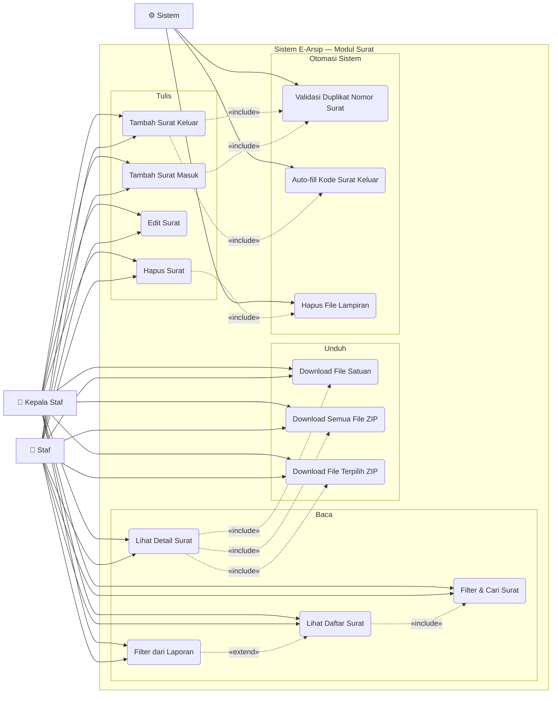

# Use Case — Modul Surat

Mengelola surat masuk dan surat keluar sekolah beserta file lampirannya.

---

---

## Deskripsi Use Case

| Use Case | Aktor | Deskripsi |
|---|---|---|
| **Lihat Daftar Surat** | Staf, Kepala Staf | Tabel surat dengan pagination, ditampilkan via AJAX |
| **Lihat Detail Surat** | Staf, Kepala Staf | Modal detail berisi semua field + daftar file lampiran |
| **Filter & Cari Surat** | Staf, Kepala Staf | Dropdown jenis (Masuk/Keluar), sorting, dan kolom search bebas |
| **Filter dari Laporan** | Staf, Kepala Staf | Navigasi dari halaman Laporan membawa params `bulan`, `tahun`, `jenis_surat` |
| **Tambah Surat Masuk** | Staf, Kepala Staf | Form: no surat, tanggal, perihal, instansi, pengirim, lampiran |
| **Tambah Surat Keluar** | Staf, Kepala Staf | Sama seperti Masuk + wajib pilih Kode Surat |
| **Edit Surat** | Staf, Kepala Staf | Ubah semua field, bisa tambah/hapus file lampiran |
| **Hapus Surat** | Staf, Kepala Staf | Hapus surat beserta semua file dari storage |
| **Download File Satuan** | Staf, Kepala Staf | Unduh satu file lampiran |
| **Download Semua File ZIP** | Staf, Kepala Staf | Zip seluruh lampiran satu surat |
| **Download File Terpilih ZIP** | Staf, Kepala Staf | Zip file-file yang dicentang |
| **Validasi Duplikat No Surat** | Sistem | Cek keunikan nomor surat per kombinasi instansi + tanggal |
| **Auto-fill Kode Surat Keluar** | Sistem | Dropdown kode surat di-fetch dari `/surat/kode-surat-keluar` |
| **Hapus File Lampiran** | Sistem | Otomatis hapus file dari disk saat surat dihapus |

## Aturan Bisnis

- Nomor surat harus unik (cek via AJAX real-time saat input)
- Surat Keluar **wajib** memiliki Kode Surat
- Minimal **1 file lampiran** saat tambah surat
- Kolom search mencakup: `no_surat`, `perihal`, `instansi`, `pengirim`, `penerima`, `keterangan`
- Filter dari Laporan menjaga params URL tetap intact selama berada di halaman Surat
