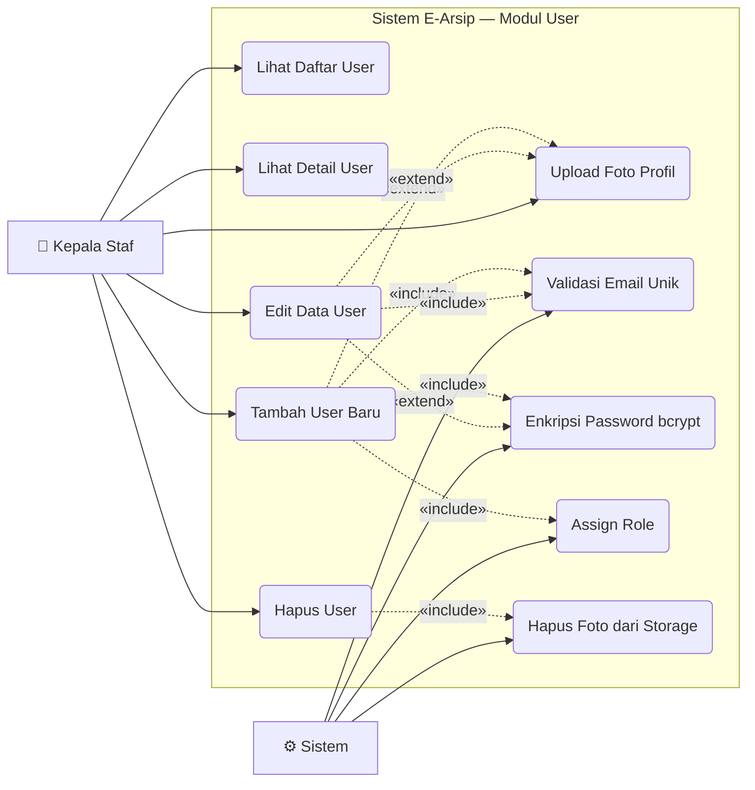

# Use Case — Modul User

Manajemen akun pengguna sistem. **Hanya dapat diakses oleh Kepala Staf.**

---

---

## Deskripsi Use Case

| Use Case | Aktor | Deskripsi |
|---|---|---|
| **Lihat Daftar User** | Kepala Staf | Tabel semua pengguna sistem beserta role dan foto |
| **Lihat Detail User** | Kepala Staf | Modal detail berisi semua informasi akun |
| **Tambah User Baru** | Kepala Staf | Form: nama, email, password, role, foto (opsional) |
| **Edit Data User** | Kepala Staf | Ubah nama, email, role, foto; password opsional diubah |
| **Hapus User** | Kepala Staf | Hapus akun beserta foto dari storage |
| **Upload Foto Profil** | Kepala Staf | Upload gambar profil user (opsional) |
| **Validasi Email Unik** | Sistem | Cek keunikan email di tabel `users` |
| **Enkripsi Password** | Sistem | Hash password menggunakan `bcrypt` sebelum disimpan |
| **Assign Role** | Sistem | Set `id_role` dari pilihan: Kepala Staf / Staf |
| **Hapus Foto dari Storage** | Sistem | Hapus file foto dari `public/assets/foto_admin` saat user dihapus |

## Role yang Tersedia

| Role | `id_role` | Akses |
|---|---|---|
| **Kepala Staf** | `1` | Semua modul: Dashboard (full), Surat, Siswa, Kode Surat, Laporan, User |
| **Staf** | `2` | Dashboard (terbatas), Surat, Siswa, Laporan |

## Aturan Bisnis

- Modul User **tidak muncul** di sidebar untuk Staf (`id_role != 1`)
- Route `/user` tidak memiliki middleware tambahan di route file, tetapi akses dikontrol via tampilan (sidebar menyembunyikan menu untuk Staf)
- Password minimal **3 karakter**
- Email harus unik di seluruh tabel `users`
- Foto disimpan di `public/assets/foto_admin/`
